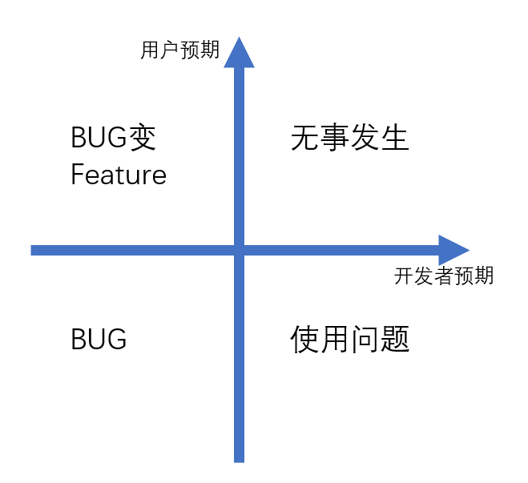

[TOC]

# Chapter 13: 用户反馈

## Section 13.1: 什么是用户反馈

### Subsection 13.1.1: 反馈的类型

这里的“反馈”不同于我们在UI设计部分提到的反馈，指的是在产品运营过程中由用户给出的对产品的意见，这部分意见可以让开发者更好地聆听来自用户的需求，并且反哺于产品设计本身。

简单的来说，反馈可以分为 **当前产品的不足**，**未来产品的期待** 两部分。

当前产品的不足主要是用户在使用当前版本产品的过程中，对当前已提供功能的反馈。而未来期待则是对目前未提供功能的建议。

对反馈内容的分类一般来说和产品的类型，与我们收集用户反馈的目的有很大关联，下面是一些可参考的分类方式：

1. 使用问题：用户无法按设计者预期使用产品的问题，即这个问题是符合开发者预期的，但是是不符合用户预期的
2. Bug：目前功能运行过程中存在的不符合设计者/开发者预期的问题
3. 新功能需求：希望产品拥有的功能
4. 改进类问题：用户对目前产品已实现功能或其展现方式（UI或交互）上的问题
5. 价格/账单问题：涉及付费的产品可能存在的机制问题
6. 普通的正面情绪：对于产品的正面评价，但不涉及建议
7. 普通的负面情绪：对于产品的负面评价，一般会附上产生情绪的原因。但我们可以将类似的反馈剥离成功能反馈和情绪反馈两部分。
8. 垃圾反馈(对于处理那些没意义的反馈是很有用的)：不会给开发者带来任何意义的反馈，如未详细描述的bug，毫无根据的情绪反馈。
9. 其它(用于那些难以分类的反馈，当你在剩余数据中发现更多模式的时候，你可以重新分类它)

上面是对总体反馈内容的分类，但基于你的实际业务，你可能也需要将反馈对应到具体的业务模块。

如先分为：

+ 功能性反馈：对已有产品功能（解决方案）的反馈
+ 设计性反馈：对已有产品设计（UI和交互）的反馈

如果这两部分内容的思考者是我们pm自己，那么其实就分别对应着我们的需求分析、解决方案章节内容和UX,UI，交互部分章节内容。

也可以继续到更细的分类，以便于归类到具体的开发人员，这对后续的反馈处理十分重要。

如设计性反馈可以分为：主页的反馈，第x页的反馈...

如功能性反馈可以分为：针对功能a的反馈，针对功能b的反馈...

另外的，反馈也可以分为用户主动的反馈和用户被动的反馈。

### Subsection 13.1.2: 反馈的重要性

产品最终的目的是服务用户，因此用户的反馈对于产品来说至关重要，是开发者聆听用户真实意见的重要渠道。

通过反馈表达对用户的关注，也会让用户留存以及转化。

## Section 13.2: 反馈对象与反馈内容

### Subsection 13.2.1: 反馈对象

就像我们在需求处考虑的用户画像一样，使用我们产品的不同类人群的划分仍然存在。不同类人群提供反馈的侧重点可能不同，我们也应该根据他们的类型赋权考虑他们的反馈内容。

如对一个付费软件来说，非会员往往会注重免费功能的体验而会员则会注重与付费功能的使用体验。

因此基于我们的业务和用户的行为，我们又可以将反馈对象分为许多类别，如

+ 付费用户与免费用户
+ 高频使用本产品的用户和低频使用本产品的用户
+ 使用我们核心业务为主的用户和使用我们边缘业务为主的用户
+ ……

加之，我们先前对反馈的问题进行了一定程度的分类，那么对于每类用户每类问题都应赋予一份考虑的权重。

如付费用户，高频用户，核心业务用户显然在反馈中应占有较大的权重值，因为他们是我们产品最应该挽留的核心用户群。除此之外，不同用户对不用问题的关注程度也有不同。如我们的设计师用户们显然对于产品的UI和交互设计更为严格。

认识到反馈对象的分类对我们后续各项内容十分重要。

### Subsection 13.2.2: 反馈编码

用户反馈给你的往往是最初等的文本，这部分文本距离严谨的反馈结果，需要我们对其进行重编码才能作为完整且规范的反馈。

例如当用户给予了一条原生的反馈文本后，你可以按以下类别进行进一步编码

+ 反馈的类型
+ 反馈对象的分类
+ 反馈优先级
+ 反馈内容
+ 解决方案
+ 备注
+ ……

这可以帮助你更清晰地得到用户真正的用意。

如我们得到了一条如下反馈

> 我很喜欢你们的产品！要是能在朋友圈的评论回复表情包就好了！

你可以将其按上述方式解构

| 类别         | 值                                                          |
| ------------ | ----------------------------------------------------------- |
| 反馈类型     | 新功能需求                                                  |
| 反馈对象     | 一般用户                                                    |
| 反馈优先级   | 4/5（数字越小越靠优先） 具体分配优先级的方法按照你的约定 |
| 反馈内容分类 | 朋友圈功能                                                  |
| 反馈内容细节 | 允许在朋友圈评论区发送表情包                                |
| 解决方案     | 待开发人员描述                                              |
| 备注         |                                                             |

当然，编码的方式并不是唯一的。在不断尝试反馈工作流的过程中，你需要不断改进你的编码。如随着你对用户反馈的把握和开发人员给你的反馈，你会意识到你原先所分的 **Email问题**其实又细分为 **Email发送问题**和 **Email接受问题**这两个子问题，这两个子问题之间的逻辑和原因可能天差地别。在这个过程中，你对开发人员解决方案的思路可能也有进一步的了解，这个问题背后的涉及到哪一部分的代码可能在之后由你就直接预判断出来并直接分配到对应的开发人员处。

给反馈进行编码的另一重要意义是：你可以用数据分析的思路去处理这部分反馈，深度挖掘出更有意义的结果。

这会使得用户的反馈具有更高的价值，详细内容你可以翻阅数据分析部分内容。这里只给出几个简单的例子：

例如：最简单的，你可以分析用户对哪些功能抱怨最多；用户对哪些新功能的呼声最高；用户使用中频率最高的问题是什么，这或许可以指导我们添加更多的用户导引。

更深度一些的，你可以尝试寻找反馈之间的关联性，分析这部分用户的属性。

值得一提的是：如果你决定把这些编码后的用户反馈存进数据库内以供后续使用，那么最好提前思考好一个固定的编码逻辑，而不要反复地进行迭代修改，这会给数据存储上带来较大的困难。

### Subsection 13.2.3: 反馈内容的甄别

身为运营人员，我们不能指望用户带来的每一条反馈都是充分且有效的，事实上，由用户带来的大部分反馈都是无效的，我们如何去甄别这些反馈内容呢？这是本节的主要介绍内容。

**用户对需求的表达**

运营者总是希望从反馈中提炼出用户的需求，从而对应到目前产品的不足或可改进之处。但用户对需求的表达未必清晰，如下列反馈：

> 感觉网易云音乐的“听歌识曲”功能用着很不方便。
>
> 垃圾软件，狗都不用。

对于这些需求，我们仅能读出用户情绪中表达对产品的不满，却无法具体到某一个具体需求的满足上。因此这部分需求表达不清的反馈应当被标记为无效。

**评估需求的价值**

用户在反馈中往往会提出一些新的功能期许，对产品经理来说，这是难得的直接听取用户意见的渠道。但用户提出的需求大多是缺乏价值的。对反馈阶段的需求，需要用迭代的眼光去判断其价值。

**一个需求的价值 = 新体验得分 - 旧体验的峰值得分 - 更新成本**

其中最为复杂的是更新成本的评估，对于UI上和交互上的改动，这取决于交互和UI本身设计的难度，一般来说这部分功能会简单一些。

对功能上的需求，则牵扯到功能所在的逻辑。如果相关功能的修改会牵扯到许多其他功能的运作，那么往往会带来比较大的成本。如希望QQ能提供一个类似微信中对好友加标签的功能。那么就涉及到QQ空间访问权限按标签运行，群聊标签筛选等一系列功能，涉及到许多相关功能的逻辑修改。另外，新功能的提出往往需要反映到UI和交互上，功能所在页面的UI和交互是否有修改的余地也是更新成本的一个重要构成要素。最后，开发的代码逻辑也影响更新的成本，一些在产品眼中简单的功能，但在代码逻辑上可能涉及到大量的改动，这部分成本需要与开发人员协商。这也提示我们在开发的初期要注意功能的前瞻性，对产品来说尽量提供模块化的功能，对开发人员来说也应该在代码上具有前瞻性。

而对大部分用户来说，他们往往忽略了更新带来的成本，仅注重了体验的提升。这使得这部分需求尽管有道理，但在实际操作上可能具有较大的难度。

而在体验衡量，成本综合考虑上，可以使用到我们在需求分析中提出的需求评估矩阵等评估方法。

### Subsection 13.2.4: Bug反馈

Bug反馈是一类特殊的反馈，其他反馈都是提交给产品经理，为了更好地产品迭代，而Bug是需要提交给开发者的内容。这类反馈的内容是不符合开发者预期的。因此在这类问题上我们需要安抚用户的情绪，并且以较高的优先级尽快解决这一问题。

对较为成熟的开发流程来说，大部分Bug都应该在测试阶段被发现并且解决，剩余的部分也应该在灰度测试发现。

类似上一个部分的反馈甄别，用户提出的有关Bug的反馈也需要进行一定的甄别。

**区分使用问题与Bug**

使用问题是最容易与Bug混淆的一类问题。前者是由于用户操作不当产生的，后者是由于程序出现了问题不符合设计者预期产生的。

我们首先确保问题出现在我们服务端而不在用户端。

例如当我们接收到如下有关淘宝用户的反馈时：

> 我这里没有收藏店铺的按钮

运营人员需要仔细收集用户操作的过程（如通过截图，录屏等更详细的过程）来确保用户的操作逻辑正确，排除用户误操作的原因。

值得一提的是，这类容易混淆的使用问题也指导着我们如何提升用户体验，指引了设计者在什么部分优化对用户的导引。具体的设计方法可以阅读UX设计部分的章节。

**可复现与问题定位**

由于Bug需要最终提交给开发者，如何确保Bug所在处是可以被开发者准确定位的呢？可复现几乎是最重要的一条。

可复现指在一定的操作环境下，测试者沿着一定的操作逻辑，可以稳定重复出现。

否则，如果开发人员和测试人员沿同样操作逻辑却无法复现错误，那么将无法定位到问题所在处。因此作为收集反馈的运营人员，确保可复现的Bug再提交给开发人员是十分重要的。

对于确认不是用户者操作有误，并且又无法复现的情况，我们就需要从反馈者处收集更多的信息，以缩小复现范围。

如对于手机App开发来说，手机的操作系统版本，UI版本，手机设置等都是可能会影响复现的重要因素。如这个Bug仅在Harmony OS上出现，当用户反馈这个Bug而我们在其他操作系统上无法复现时，如果询问了用户的操作系统版本，再去在对应Hormony OS上复现时就会成功。这个过程就像是不断缩小范围的排列组合过程，需要运营人员具有一定的耐心。

对于特殊的业务，开发人员可能会以日志的形式记录下运行的错误。因此也可以与开发人员沟通，确认是否存在开发日志以定位错误的可能，然后让用户提交相关的日志，帮助开发者定位问题。

总而言之，如果一个无法定位的问题提交到开发者，那么它也是无法解决的。运营人员应时刻牢记可复现的思想，这对减轻开发人员的负担和尽快定位问题以解决问题都十分重要。

**尽可能原始的反馈**

反馈者可能会基于自己的错误认知将错误定位到错误的位置，这时运营人员在复现尝试无果后，应让反馈者提供尽可能原始的反馈，以避免由反馈者自己理解错误带来的错误反馈。

如用户在进行操作A后紧跟操作B，这时操作B出现了错误，是由于操作A的一系列影响。而用户在反馈时可能仅提到操作B时发生了错误，而忽视了操作A的影响，这时我们应让用户提供完整的操作步骤，这样才可以发现操作A在Bug中的地位。

**Bug提交给开发者**

基于上述原则，当Bug被提交给开发者时，应当具有以下要素

+ 反馈的原始信息
+ 复现Bug的方式和必要条件
+ 初步猜测的问题定位
+ 其他由开发者要求提供的内容，如运行日志，用户ID等

### Subsection 13.2.5: 总结

分析用户反馈的数据是一件非常困难的事情，本文部分仅仅提供一个思考的范式而未必是标准答案。事实上由于你产品特性的不同，核心用户群的不同，业务逻辑的不同，用户反馈渠道的不同，用户带来的反馈特点也不同。根据具体情况具体分析，总结出一条最适合你的产品和当下业务的产品从**用户反馈**到**整理反馈**到**反馈开发**到**反馈用户**的通路才是作为一个运营人员最应该思考的。

## Section 13.3: 如何收集用户反馈

说了这么多，我们如何才能收集到用户的反馈呢？这一部分的内容与我们介绍的调研方法略有相似，但也有许多不同的地方。相比于产品前期的调研，用户反馈的收集是建立在已有产品模块的基础上的，因此我们可以通过更精准的收集方式来达到我们的目的。

收集用户反馈的方式可以简单分为 **主动收集** 和 **被动收集**。主动收集指的是运营方主动向用户收集意见，如我们最常见的“你是否参与用户体验改进计划”并填问卷上的几道题，对运营者来说是主动收集的方式，对用户来说则是被动的。被动收集指的是我们提供用户主动向我们提供反馈的方式，如邮箱、自制反馈渠道等，由用户主动地向我们提出反馈，对运营人员来说则是被动的。

### Subsection 13.3.1: 主动收集

在主动收集上，和调研的思路一致，我们需要有明确的收集目的，即这部分数据是为了满足什么目的收集的。愿意为我们提供反馈数据的用户一定是我们最忠实的用户，因此收集来自他们的反馈需要尽量确保收集的意义，以避免消磨用户的耐心。

由于主动的特点，主动收集一般都以弹出页面的方式询问用户是否参与收集。这样的方式会给用户带来极大的困扰，给用户带来负面的体验。因此在设计主动收集方式时要尽量达到的目标是：

+ 尽量做到对用户的筛选，使得目标用户之外的用户不被打扰

+ 减弱收集给用户带来的感知，交互上不要给用户带来过大的负担

  

基于这些要求，这时我们应该充分利用现有的产品架构做精准化的收集。

**页面精准化**

我们的主动收集最终要在UI上呈现给用户，通过合理选择呈现反馈收集的页面可以达到精准收集的目的，如

+ 对特定UI界面的反馈可以放在该界面附近
+ 对特定功能的反馈可以放在功能相关逻辑的页面上
  + 如问卷星对问卷体验的收集界面往往在创建完新的问卷后

这样的设计一方面使得反馈收集不会打扰到我们收集目标之外的用户，同时也让目标用户更容易进入到我们的反馈渠道。

**对象精准化**

在本章的一开始就提到了我们需要对反馈对象进行一定的分类。这时当我们需要收集某一类特殊用户的反馈时，就可以考虑这一类用户的使用场景，并在最具有其代表性的页面上进行收集。

如当我们想要收集会员用户的反馈时，就讲收集渠道设置在类似“会员中心”的页面中。

**基于用户数据收集**

我们可以基于用户在使用过程中的数据来对收集对象做进一步的筛选。如我们希望对某一个界面较为深度使用的用户进行收集，那么可以基于用户在该页面停留时长，点开页面的频率等进行筛选。至于如何获取到这些用户数据，可以参考数据埋点思路章节。

为了在交互上给用户更好地体验，主动收集反馈的交互应是清晰简洁的，能让用户在看到提示后迅速明白这是一条收集反馈的信息，并且让不愿意提供反馈的用户能直截了当地关闭并回到原界面。否则过于繁杂的页面，怎么也关不掉的交互，就成了流氓软件的设计方案了。

### Subsection 13.3.2: 被动收集

对于被动收集的方式来说，我们首先需要确保收集反馈的页面是足够明显的，让需要主动提交反馈的用户能迅速找到反馈的入口。并且在日常就应通过一些方式告知用户——当你遇到问题时可以来此进行反馈。

另外在具体反馈的方式上，我们有许多可选的方式：

+ 向官方邮箱发送邮件
+ 自制的反馈问卷系统
+ QQ群等基于现有方案的反馈渠道

我们应选择用户接受程度最高的。如对于国外的用户来说，使用Email是家常便饭的事情。但对于国内的用户来说，却并不习惯使用Email。类似的调研你可以在各类社会调查中见到，如果你感兴趣，可以去展开搜索。因此对于国内的用户来说，使用Email进行反馈就不那么友好。

在反馈的具体页面上，也应该充分考虑UI和交互的设计，让提交反馈的用户能够

## Section 13.4: 用户反馈与产品目标的动态平衡

## Section 13.5: 反馈结果的利用

### Subsection 13.5.2: 如何将反馈报告给开发者

### Subsection 13.5.3: 如何从反馈中总结开发计划

