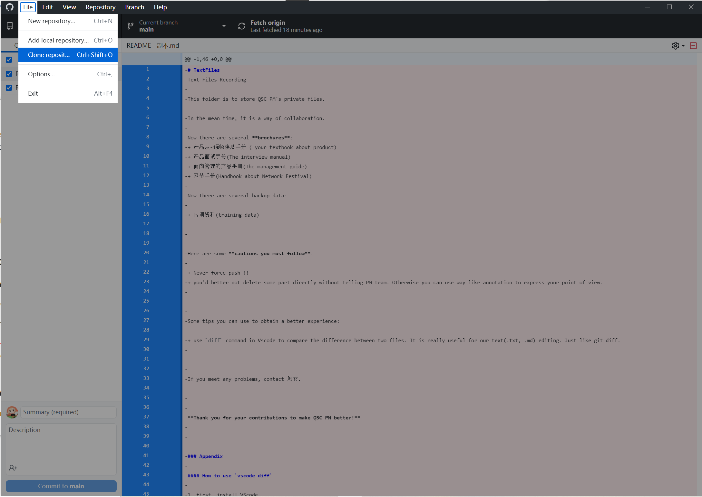
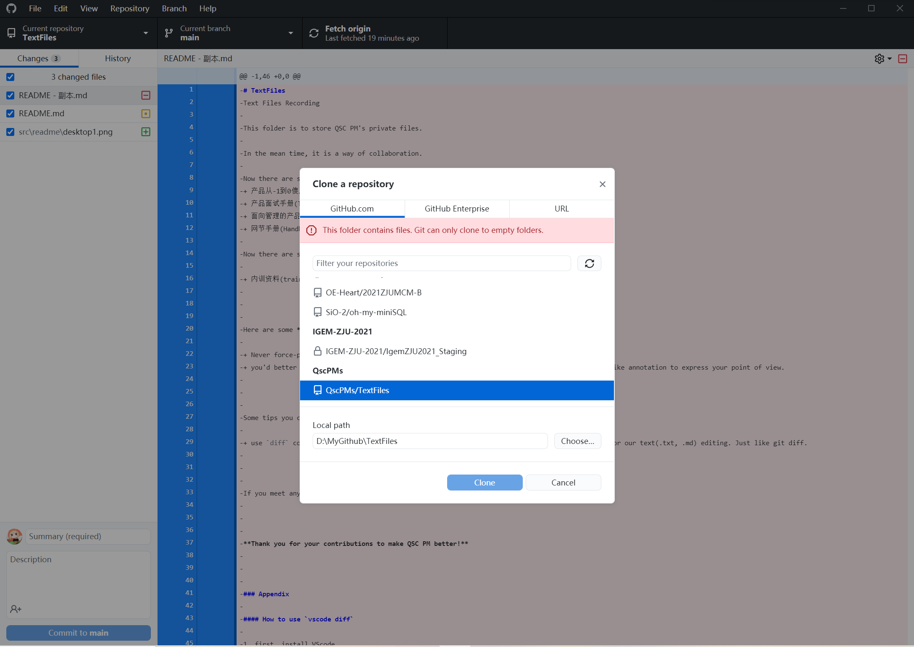
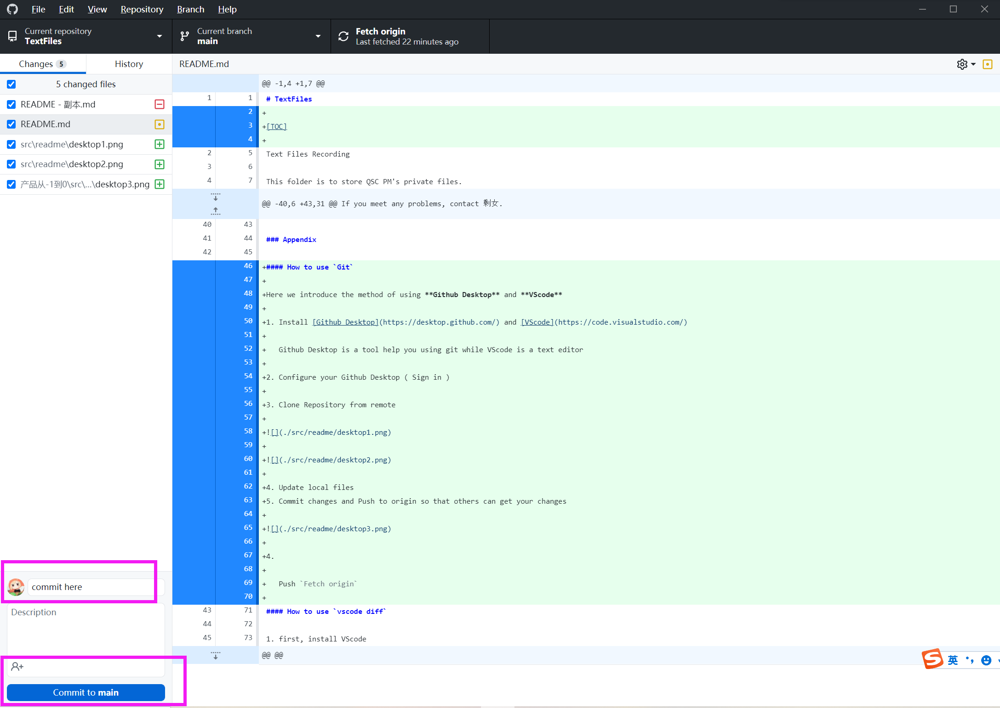
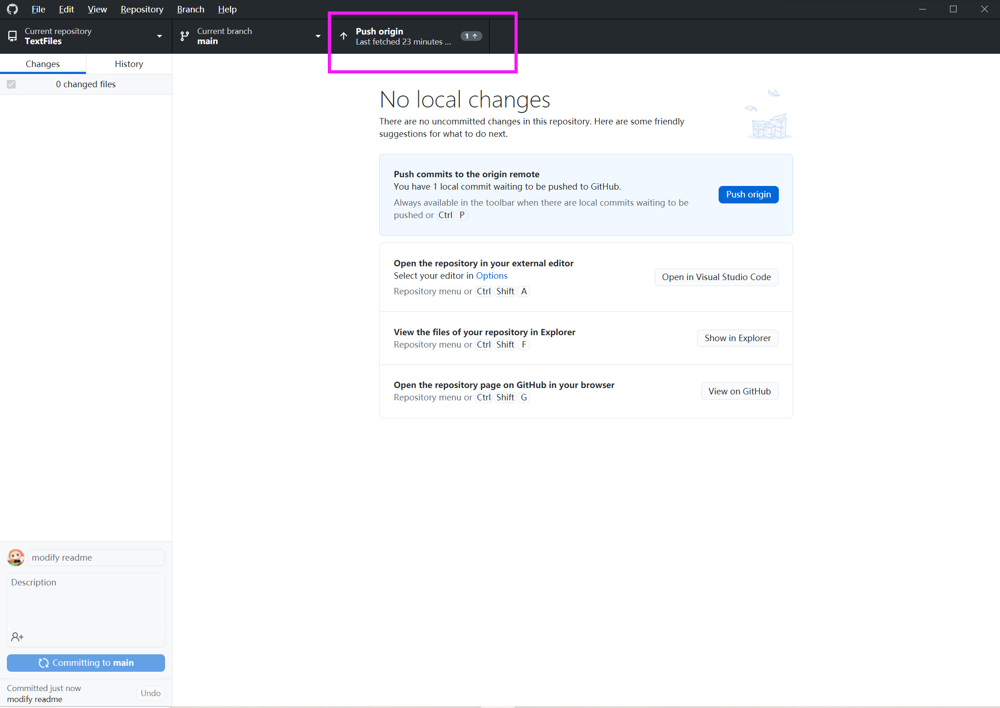
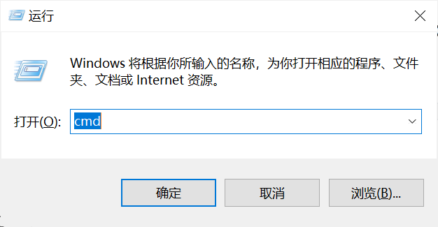
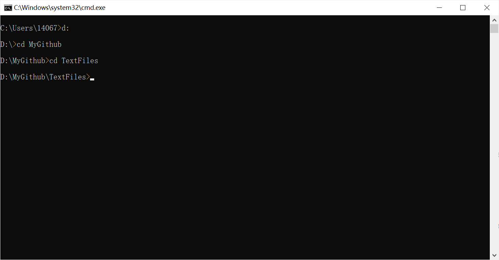
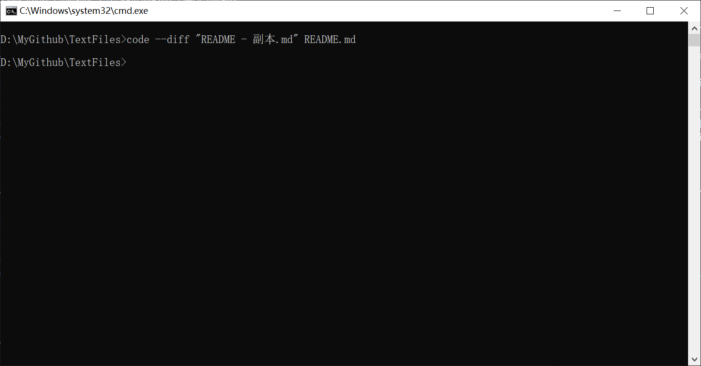
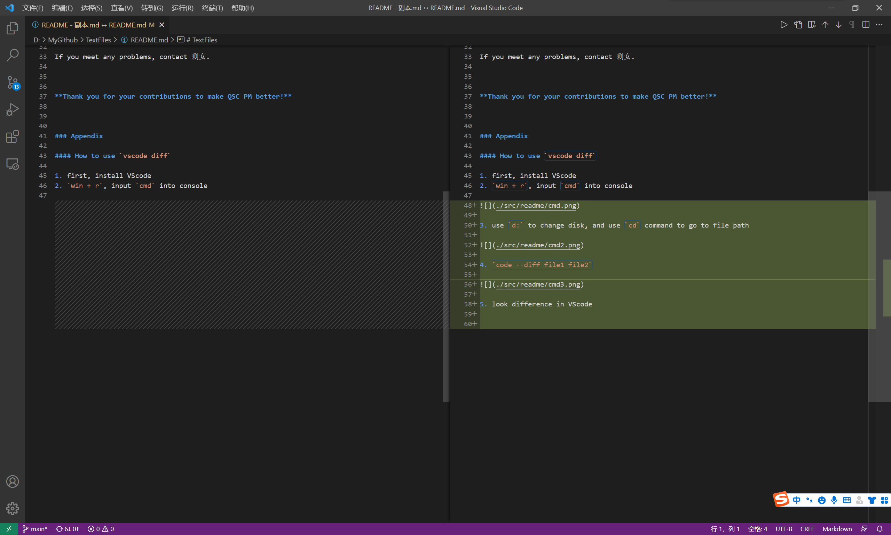

# TextFiles

[TOC]

Text Files Recording

This folder is to store QSC PM's private files.

In the mean time, it is a way of collaboration.

Now there are several **brochures**:
+ 产品从-1到0傻瓜手册 ( your textbook about product)
+ 产品面试手册(The interview manual)
+ 面向管理的产品手册(The management guide)
+ 网节手册(Handbook about Network Festival)
+ 写给求是潮产品的历史书(History book)

Now there are several backup data:

+ 内训资料(training data)

Here are some **cautions you must follow**:

+ Never force-push !!
+ you'd better not delete some part directly without telling PM team. Otherwise you can use way like annotation to express your point of view.

Some tips you can use to obtain a better experience:

+ use `diff` command in Vscode to compare the difference between two files. It is really useful for our text(.txt, .md) editing. Just like git diff.

If you meet any problems, contact 剩女.

**Thank you for your contributions to make QSC PM better!**

### Appendix

#### How to use `Git`

Here we introduce the method of using **Github Desktop** and **VScode**

1. Install [Github Desktop](https://desktop.github.com/) and [VScode](https://code.visualstudio.com/)

   Github Desktop is a tool help you using git while VScode is a text editor

2. Configure your Github Desktop ( Sign in )

3. Clone Repository from remote

4. Update local files
5. Commit changes and Push to origin so that others can get your changes

​	BTW, you can view your changes here.

6. Push to origin

Here may remind you **you need to fetch first**. That is because someone else modified files and push to origin, you need to `pull` first.

If you meet conflict which is because your changes are contradict with someone else's. Click view in VScode, and select which changes you want to preserve and then save.

If you meet any problems, contact 剩女.

#### How to use `vscode diff`

1. first, install VScode
2. `win + r`, input `cmd` into console

3. use `d:` to change disk, and use `cd` command to go to file path

4. `code --diff file1 file2`

5. look difference in VScode

