# 产品从-1到0

> 本文是写给那些希望了解产品设计究竟是怎样的过程，求是潮产品运营部门在做什么，同时希望加入我们的同学。您可能并不懂什么是”产品“，什么是”运营“。甚至，你可能对它们有并不准确的理解。所以本文的标题是从-1到0.我们希望你在看完之后能有一个对产品、运营的初步印象，同时也对我们的工作有一些基本的了解。


[TOC]


## 编撰说明

+ 有参考资料的地方务必标注（比如加括号，像这样
+ 图像在**src/img/你的名字**  文件夹里，否则无法共享。起名规范什么的之后再说吧…暂时自由发挥
+ 有其他需要本地存储的资源在src中新建文件夹即可
+ **请勿直接删除他人的文字——除非在群里提前做过了交流**
+ 大家可以在Git的History中看到别人提交的部分，建议大家每次pull后观看一下历史看看更新的进度

  


## 好idea存档处

+ 愚蠢的音量交互
+ 水波纹 —— 反馈
+ 对三角和圆形要比方形适当的放大——等六蛋的视频
+ UX部分：离大拇指近一点
+ B端C端产品
+ 解耦


## 前言

### 什么是产品

首先让我们从**产品**开始。

产品，顾名思义，你所见到的几乎所有都可以抽象的被称之为“产品”。但是对我们（求是潮）来说，我们口中的产品更偏向于互联网产品。互联网产品的概念是从传统意义上的产品延伸而来的，是在互联网领域中产出而用于经营的商品，它满足互联网用户的需求。互联网产品是功能与服务的集成，可能是具象的一个网页，移动应用（手机App），也可以是互联网服务的一种思路，如互联网共享经济。

在本书中，我们更多的会以互联网产品来指代产品，这也正是我们求是潮产品主要做的事。

### 产品的组成部分

打开一个App，首先映入我们眼帘的就是：这个App长什么样。一般来说，我们把它叫做**UI**（User Interface，用户界面），即用户界面的整体设计，包括页面内的组件设计与不同页面之间的布局。

当我们点击，拖拽时，我们其实就正在与UI进行“交流”，一般来说我们把这个过程叫做**交互**（Interaction）。即我们是以什么样的方式告诉UI我们想要做什么的。

在用户使用App的过程中，用户的体验如何决定了我们是否可以提升用户粘性，保留用户占有量。我们把这个部分叫做UX（User Experience）.


### 什么是产品经理

在知道了产品大概是什么之后，那么什么是产品经理呢？

产品经理（Product Manager）脱身于项目经理（Project Manager），在公司中是指针对某一项或某一类产品进行规划和管理的人员。研发，制造，营销，运维等工作都在其职能范围内。产品经理是很难统一定义的一个角色，因为针对不同的产品，不同的分工，他在不同的公司中可能有不同侧重的职能。但相通的是，产品经理和产品紧密联系，他的目的就是让产品变的更好。

那么对于求是潮产品经理而言，我们不具有制造，营销等具有现实经济意义的职能。所谓产品运营部门，顾名思义，“产品”和"运营”就是我们职能的全部。二者中，“产品”倾向于产品的创生，“运营”倾向于产品的迭代。

产品经理尽管有了整体开发的思路，却无法独自完成整体的开发，一般来说，还需要设计师和工程师的配合。在本书的末尾，我们也会简单介绍一下我们是如何与其他部门协作，高效地进行沟通与合作的。

最后的最后，我们也会简单介绍一下求是潮的产品，以便大家对我们有一个整体的了解。

那么让我们现在开始逐步拆解产品的各部分，学习如何思考设计一个App.


## UX

产品是设计来给用户使用的，因此用户是否觉得好用，体验如何，直接决定了是否有人会用你的产品。

在我们真正学习如何设计一款产品前，不妨先以现有的产品为例，以UX的视角评价已有的产品。这可以帮助你在设计自己的产品时，有一个足够清晰的评判指标，帮助你做出更好的产品。这引出了我们这一章节的主题——UX（User Experience），用户的体验。我们希望提高用户在使用我们产品时的体验，从而拥有更高的用户粘性，获得更多的用户。

尽管我们还不知道一个App具体有什么，但结合我们平时对App的基本了解，我们可以思考怎样才是好的UX，一般来说，好的UX有以下三个要素：

+ Useful - 有用的
  + UX设计一定要能真正满足一些需求，而不是产品经理的自娱自乐。
  + 举个例子：扫码共享电话的设计就显然是一个Useless Design.
+ Usable - 易用的
  + UX设计应尽可能减轻用户的负担，让用户觉得“没那么复杂”
  + 举个例子：如果借书需要出示身份证-> 手机二维码 -> 手动输入书的编号 -> 付款 -> 完成借书。用户一定会觉得非常复杂而出于畏难情绪不愿使用。但如果你仅仅需要“刷脸”，借了哪些书会由摄像头判断，身份验证与付款都通过支付宝人脸识别完成，那么用户的负担就被我们降低了。
  + 此外，易用的UX设计可以降低用户的学习成本，使得我们的产品即使是对一个小白也非常容易上手。
+ Desirable - 令人渴望的
  + 产品的宿命是被用户使用。因此用户如何想，决定了UX设计的质量如何。只有当用户真正需要，或渴望去使用时，那么你的产品才称得上是一个好产品。
  + 当然，Useful, Usable本身也都是决定产品是否Desirable的关键要点。除此之外，是否有足够的新意，是否在竞品中存在优势，甚至当前的用户市场份额，都会影响用户的决断。
  + 当我们在现实中开发产品时，已有的市场和竞品是无法忽略的。Desirable可以帮助你从一系列竞品中脱颖而出，一般由你产品的创新点或核心竞争点提供。


这三个概念足够High Level，囊括了非常多的概念。比如你可能觉得某个产品是不好用的，那么它究竟不好用在哪呢？接下来我们再给出一些更具体的判据。

### UX的评价

#### Learnability

当用户第一次使用时，需要多大的上手难度？

我们都知道，人的第一印象非常重要，对产品也是如此。如果用户第一次打开发现不会用，那么他大概率不会反思是不是自己太笨了，而是会愤怒的大喊”垃圾App，根本用不了“并且愤怒地卸载App。举个例子:


这是2021年3月21日的网易云首页，如果你是一位想使用听歌识曲的用户，你能知道需要如何操作吗？

如果你迅速的找到了——没错，就是页面右上角的那个话筒Logo.那你一定是网易云音乐的忠实粉丝了。至少对于编者一个使用了5年网易云音乐的用户来说（以前听歌识曲不在这里），在改版后我需要百度才能找到听歌识曲的位置。这就是上手难度的一个典型例子，对于第一次使用的用户来说，他太不友好了。

一种常见的提高Learnability的方法是——使用新手教程。对于游戏这或许是一种有效的方法，但对于一个希望主动抓住用户的产品来说，用户看完后大概率会忘记。就像一道数学题，当时你会了，再过一段时间，你还会吗？尤其是对于功能复杂繁多的App来说更是如此。

所以，更多的，我们希望在UX设计的本身就提供给用户更高的Learnability. 如更多的文字提示，让用户看了一眼就知道的icon（**我们会在icon部分着重讨论这个问题**）。我们并不打算在这里深入展开Learnability的设计思路，那可能需要你海量体验产品后才能有较多的感悟。

但我想你现在有一个测试Learnability的初级想法——找一个没用过的人试一下。这显然可以，但成本过高，毕竟需要提供一个给测试者的demo. 所以更多的还是需要我们产品经理来把握——从一个小白的心态。


#### Efficiency

这些概念本身也是循序渐进的。当我们已经解决了小白上手的问题，那么对于已经学会使用的用户来说，需要多久他才能完成一个任务呢？

如果你对算法有一些了解，这就像是不同的时间复杂度，我们希望尽可能降低用户完成一个任务的时间。如果你不懂，也可以看我在Usable部分写的例子。完成同样的功能，显然用户会倾向于用时最少的。

如何改善Efficiency呢，有一些值得注意的思路：

如果操作A使用频率是90%，操作B使用频率是10%。你会花更多的时间在优化哪一个操作上？答案是显然的（A，不会有人选B吧）。在产品开发过程中，每一点时间都是宝贵的，把钢用在刀刃上就是这个道理。简单来说——**优先高频需求**

以下的数学题可以用来加深你的印象。

> 三个任务A/B/C要被分配在三个页面，玩家打开第k个页面需要k步，而A/B/C使用的频率大概是50%,30%,20%.如何安排三个任务可以最大化Efficiency呢？

看到这里你可能会觉得我在侮辱你的智商。在现实的场景中，当任务一个接着一个，页面也越来越复杂时，很多年轻的产品经理都会花大量的经历在不那么重要的需求上，我只是为了加深你的印象，以免你换个马甲就不认识它了。


#### Memorability

并非所有用户一旦使用我们的App就会一直高频使用，挽留那些偶尔使用的用户对我们来说还是十分重要的。那么紧跟而来的问题就是：

**当用户一段时间不使用你的产品后再次回归，他需要如何重建熟练度？**

首先想到的就是我们用于解决一般Learnability的思路——“让操作本身变得更简单”，如果第一次上手就很容易掌握，那么再次回归只会更容易。此外，Memorability还可以通过增强操作的记忆点，特点来实现，即让用户一旦学会，就再也忘不掉。

以pendo为例，pendo是一款典型的为了交互高效、简洁，舍弃了一部分Learnability的产品。


左图是pendo有一个日程后的界面，就Learnability来说，它并不那么合格，因为没有任何引导告诉我们——右滑这条信息就可以出现删除的选项（如右图）。但就Memorability，右滑也是一个符合人的习惯的交互，且本身比较自然，你甚至不用记住右滑是删除，左滑是收藏。你只要记住每一条message都是可以滑来滑去的这一并不复杂的事情，就可以掌握Pendo的使用技巧了。

怎样才算用户能迅速重建熟练度呢？对不同的用户这个答案可能不同，对不同的产品经理它的标准可能也不同。因此我们仅仅是提醒你，这一条思路很重要，但具体如何判定，那就取决于产品经理本人了。


#### Error Rate

我们无法假设用户一定具有粘性，更无法保证用户都是“聪明”的。在我们向用户传达设计理念的时候，一方面我们需要尽可能清晰的传达，即告诉用户他们该怎么做；另一方面我们也需要容错控制，因为总有用户会“不按套路出牌”。用户更容易在那些地方犯错？我们是如何处理错误的？以及我们与用户如何可以迅速地从错误中恢复出来？

在这部分，我们不仅会向你介绍什么是Error Control，也会提及一些Error Control的方法。这部分内容可能有些多，因此我会介绍一些其它概念帮助大家理解。


Error Control背后蕴含着更深层次的思想——考虑所有情况。

用户带给你的“惊喜”远远超出你的想象。由于不同用户习惯、地域等等诸方面的不同，他们的行为差异也十分巨大。我们的App考虑的更全面，所留住的用户就更多一分。并且即使是一个如你一般的用户，也有可能有手抖，误触（手机放兜里没锁屏）等情况的发生，如果这些常见失误就会给用户带来严重的后果，那么显然是一种糟糕的用户体验。因此Error Control并不是一个出现概率低、无意义的工作，与我们先前所说的“优先高频需求”并不矛盾。因为Error Control就是每个人交互过程中不可或缺的一环。

首先我们先明确：什么才是错误的行为。你想聊天的时候点到了付款，这时付款是错误行为。你想付款的时候点到了聊天，这时聊天又是错误行为。可见错误不是针对行为本身的，而是与我们的目的有关的。与我们想做的行为不同的，都可以理解为一种错误。

接下来回答第一个问题：用户更容易在哪些地方犯错？

犯错的原因一般有两种

1. 我们没有正确传达正确的使用方法，用户不知道如何使用而出错，这是Learnability, Memorability需要着重考虑的，我们不在这里讨论。
2. 手抖、误触等等无意的错误操作，这才是我们这里着重讨论的

我们需要明白什么情况下会出现第二种情况。设想你的微信每个对话框旁就有一个大大的支付按钮，点击支付以后立马就付了钱。那么很显然，这种情况下，哪怕你知道这个点了没什么好处，但还是非常有可能出现错误。以上的例子太过极端，但是却涵盖了所有的情况，下面我们将一一展开

1. 交互过于相似
   + 事实上这已经不能算一种情形，而是错误出现的原因。如果A操作是把手机扔到天上，那你大概率不会弄错这个功能。因为除了当你需要使用这个功能时，很难想象你为什么要把手机扔到天上。
   + 大多数错误发生都是由于交互过于相似，比如点击和长按，一不留神就按过头了；两个距离很近的点击，一不小心就会点错……
2. 高频功能与易错功能过近
   + 如果每次手抖的概率是一定的，那么功能越高频，手抖的概率也就越高。而上述例子中，聊天是微信最高频的功能，在对话框旁放上一个容易出错的地方，那么这个错误出现的频率就会较高。
   + 由此引出的一种设计思想就是——不要将高频功能与其他功能的交互设置地过分相似，否则错误率就会显著的提升。
3. 错误触发过于容易
   + 在例子中，仅仅一次点击就触发了“付款”的结果。如果误触一次的概率是p，那么连续误触n次的概率就是$p^n$。如果我们需要一系列复杂的操作才能达到一个“结果”，就可以显著降低错误的概率。

上述的思路主要是“错误如何发生”，第二与第三个问题则注重于“错误如果发生了我们应该怎么办”。

上述的思路似乎并不能给我们带来太好的思路，因为我们在定义错误的时候，每个功能都可能被认作“错误”，我们又怎么能够针对性设计呢。在这里不妨想想，如果聊天出了错，你会如何？撤回，解释，好像没什么大不了的；但如果支付出错了呢，可能就会给你带来经济损失。相比之下，尽管二者都有可能出错，但我们可以粗略的把“支付”定义为易错功能——因为它的后果严重。基于此，我们就可以回答第二第三个问题了——努力通过设计让错误的后果不那么严重。

综上，以下是一些常见的设计思路

1. 提高各交互的“距离”

   + 这个思路就是针对上述的1，希望从源头上解决问题。

   + 0-1二进制信号的电压标准就是很好的例子。比如我们把0.3V看做低电平，记做0而1.2v看做高电平记做1，那么我们可能可以很好的通过电压得出0-1的数据流。但如果用0.3v来表示0，0.4v来表示1，那么两个之间的”距离”过近，就难以区分，容易发生错误。交互设计也是同理，我们希望尽量明确两个功能在交互上的区别。
   + 考虑上述2提到的情况，尤其是需要与高频功能的交互分离。
   + 但有时为了提高交互的效率，我们不得不安排较多的交互方式，这时我们仍有其他的方法需要考虑

2. 降低错误后果

   1. 解耦合
      + 有时候一个操作的结果是多个结果的耦合。比如支付，实际上是支付—对方收到的耦合。如果我们可以解开中间的这条链，那么付错了但对方却不会收到，错误的后果就被降低了。微信转账的延迟到账就是这样的思路。
   2. 可撤销
      + 如果你的错误是可撤销的，比如微信消息的撤回。那么即使你出了错，后果也会降低很多。一些文档自动保存（误关闭）也是此类的道理。

3. 提高触发难度

   + 对于易错的操作，我们可以通过增加交互难度来降低错误率。也就是对标前述的3。尽管在交互涉及的部分我们将会提到——要尽量减少每个操作用户点击的次数。但对于这种较为重要，出错结果严重的功能也可以适当的增加中间过程，常见的方式如：
     + 二次确认
     + 交叉验证
       + 如使用手机验证码+密码 之类

   


**一个小练习**：下述Error Control机制适用了哪些思想？

**微信付款时，需要点击确认付款后才能指纹支付。值得一提的是：对于有实体按键的手机，指纹支付和返回是完全重合的交互（轻按指纹识别器）**


#### Satisfaction

Satisfaction更多的是对上述因素的总述：用户的整体体验是否愉快。在这一部分，你可以把UX与UI与交互结合起来考虑。反馈感，icon设计，微动效，页面层次。我们可以在其他部分详细讨论这些内容，这里就不多做展开了。


### UX提升：

正如我们先前所说，UX更多的是一种评价产品的方式，是产品能否真正被用户喜爱且使用的重要因素。我们可以使用UX设计的思想来检验我们的产品是否合格，而具体的UX设计思想则是由之后提到的UI与交互来承载。

希望你牢记这一章节提到的思想，它们将在我们之后讲解UI与交互的时候反复提醒你——我们究竟为何如此设计。


## UI

当你刚开始做设计的时候，大概率会对下面的介绍嗤之以鼻，觉得自己有满腔UI设计的热忱，不屑于循规蹈矩。这是非常正常的现象，但当你拥有了一些UI设计经验，走了一些弯路之后再回来看这里，可能就会有一种如沐春风的快感。

因此，如果你对UI设计的思考细节不那么感兴趣，可以把重点放在简单的UI介绍上，大概知道我们说了哪些，会说哪些，等你之后想起来的时候可以再回来查阅。

对于UI这部分而言，看书对你来说可能并没有那么重要，在看书以外，你应该更多地多看，积累自己的素材。哪怕没有本书的帮助，相信你也可以总结出UI设计的一些基本套路。

### 设计感

如果你对设计一窍不通，直接突兀的进行模块化的介绍可能会让你感到一头雾水。从白纸，到一个完整的界面，我们究竟做了哪些思考和努力，我们打算先从抽象的设计感开始说起，让你有一个整体的感知。

#### 简洁明快

>少即是多。（Less is more.） 
>
>——Ludwig Mies van der Rohe

在浙大，有相当一部分人使用微信作为平时工作生活的主要社交软件（产品也是如此）。你可能会疑惑，为什么不使用QQ呢？

打开QQ和微信的页面，你会清晰地感觉到，微信比QQ的页面简洁很多。这一点对于中老年群体使得微信具有无与伦比的竞争力。事实上，随着年龄增长，越来越多的人会从“花里胡哨”的审美观走向“简洁明快”。就像从QQ迁移到微信或Tim（关于QQ以前也不是如此，微信功能的缺失这里就不做讨论了）。

为什么会如此呢？个人认为，随着生活节奏的加快，我们希望重点的内容/功能足够突出，能大量节约我们的时间。把这样的思想迁移到网页设计上，你可以参考[Apple的官网](https://apple.com)；迁移到浏览器上，你可以参考夸克浏览器。

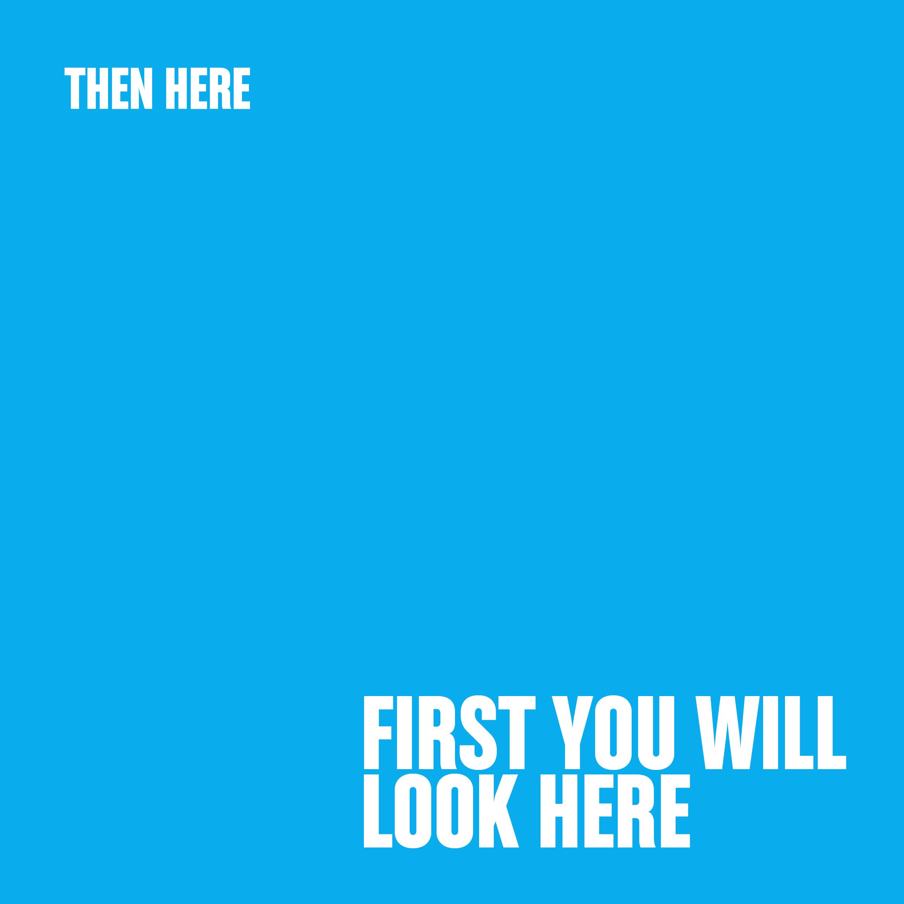

简洁的设计可以让用户较为轻松地使用我们的产品。关于这一点，我想当你在大学生活中经历过——极度臃肿，重点不明，花里胡哨的PPT后自然会改变你的审美。


#### 潮与惊喜

随着互联网的高速发展，各式各样的UI界面数不胜数。想要在这些繁多的页面中脱颖而出，就需要一定的潮流与惊喜。这些惊喜可以让你的用户眼前一亮。如当iPhone刚刚发布时，舍弃实体按键的全新交互方式就是一种惊喜且引领了潮流。

但如何设计这种惊喜呢？很遗憾，如果可以直接写在这里，那它也无法称之为惊喜了。但对于我们每位设计者来说，多看类似的产品并且思考，终有一天你也能设计出你的独家惊喜。这里推荐大家可以去搜索一些设计较为新奇的网页，它们往往具有较为新奇的交互，尽管它们之中有的已经丧失了产品性和功能性，用先前的UX评价去度量也并不友好，但这对启发你的新奇设计思路或许有所帮助。

这也提醒我们不应该一味的追求“新”，在设计UI的过程中，也要考虑到UX部分的Learnability, Memorability等因素，让用户能够迅速掌握。

在UI的剩下部分，我们会更多地抛开“潮”，介绍一些基础的UI界面，从零开始培养你的设计感觉。


### 基础布局

在一个经典的UI界面中，我们会看到许多熟悉的布局。

#### TabBar - 标签栏

TabBar是App中最经典的基础组件。我们可以通过不同的功能标签（Tab）迅速进入对应的功能界面。一般来说，Tab是通过icon或文字体现的，并且需要我们在之后交互部分提到的**反馈感**。

最经典的TabBar或许就是通过icon+文字来体现一个Tab，并且通过两套icon来体现当前状态的反馈感。我们熟悉的微信就是最经典的例子。

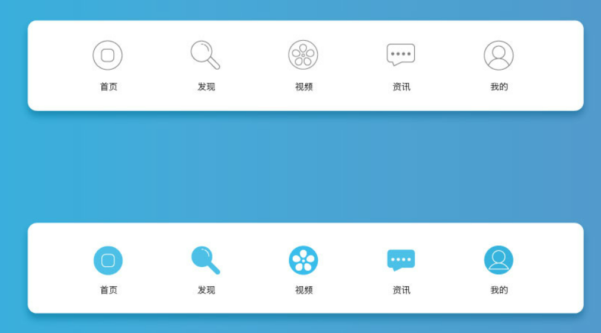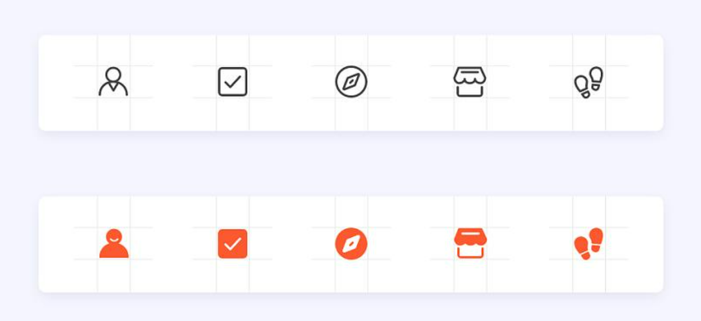

有的App也会只会使用icon和文字中的一个，使得整个页面更加简洁，当然，如果你只使用icon，那需要确保icon对信息的传达足够到位。

TabBar设计的一个要点是**反馈感**。简单来说，就是让用户知道目前所处的页面是什么。大部分App是通过两套icon，当前的页面对应的icon会切换，更改Tab的背景色，更改文字的颜色，在下方或上方加上标志位置的下划线，这些都是能清楚地告诉用户当前处在哪个页面的优秀方式。

TabBar作为经典组件，似乎很难做的特别有新意。但在反馈，和微小的动效上也可以做出不同的设计以适配不同风格的App。仅仅Tabbar设计细节的展开就可以长篇大论许多，但我们在这里不作展开，如果您感兴趣，可以自行去了解。事实上，接下来要说的UI设计的每一个小的部分其中都暗藏许多可以讨论的地方，都有待你的主动探索去发现。


#### Silde Menu - 侧滑菜单 / Draw Layout - 抽屉

在许多App中，都有侧面菜单的样例。如下图


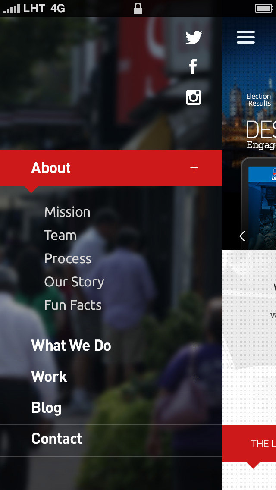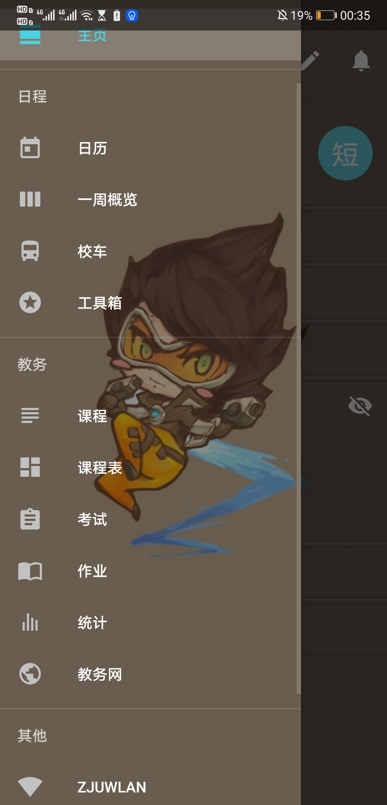


两种看似完全相同的逻辑其实分别属于侧滑菜单与抽屉。从功能上来说，他们似乎一模一样，但相信你也很容易发现他们在设计上的不同——高度不同。抽屉明显处于页面的“上方”，而菜单则更倾向于“平级”或”下方“。在Material Design的语言中，我们会说他们的z轴高度不同，具体的z轴我们会在接下来的组件设计部分提到。

从功能上来说，侧滑菜单与抽屉提供了更多功能页面的入口方式，属于导航的一部分，让我们可以集成更多的功能。但相比于TabBar，侧滑菜单与抽屉需要你先唤出侧边栏才能开始导航，而随着全面屏手势的发展，侧边滑出唤醒会与全局返回手势冲突，唤醒的方式有时候就变成了左上角或悬浮在右下区域的一个小小的汉堡按钮。因此在侧滑菜单或抽屉中的功能会让用户耗费更大的成本，因此，根据我们在UX部分的设计理念，我们应该主要把相对较为低频的功能放在这里。


#### WaterFall - 瀑布流

瀑布流是用于逐条信息浏览的场景，在较多内容的页面中，它是最常见的内容组织方式。微博的信息量，微信公众号，甚至你的闹钟，都是在以瀑布流的形式向用户展示信息。

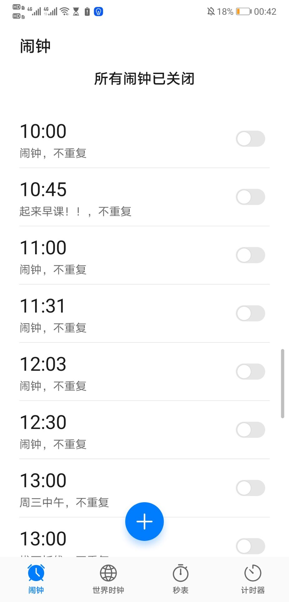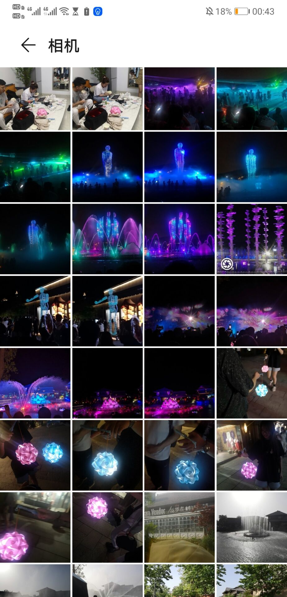

更细的划分下，我们还可以把瀑布流分为单列瀑布流与多列瀑布流，顾名思义，列数的多少就是划分的关键。我们的淘宝推荐，图库，就是以多列瀑布流的形式存在。相比于单列，多列瀑布流可以集成更多的信息。


#### Card - 卡片

如果每一条信息需要展示的要素较多，那么瀑布流可能并不那么适合。卡片与滑块是另一种可以替代的方式。通过赋予组件更高的z轴高度，以及让组件之间有较为明显的分割，使得每一条信息都能相对突出，而不像瀑布流一样信息之间较为密集

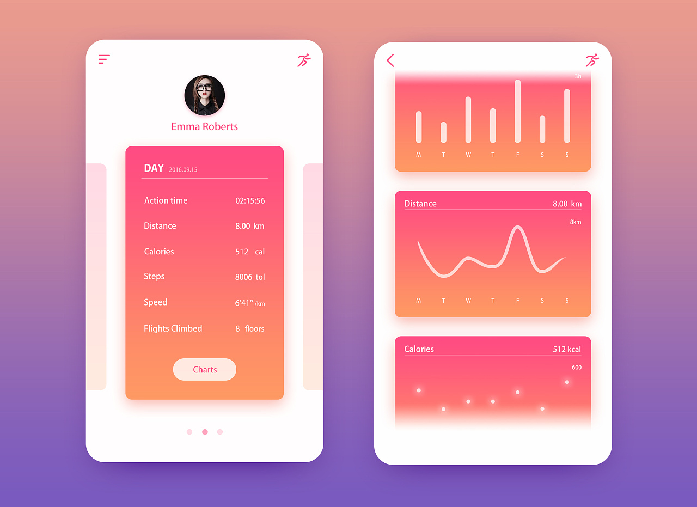

从阅读体验上来说，瀑布流更像是一种被动的阅读，如淘宝的商品，用户会去主动的选择；而卡片和滑块则更像是主动的把信息呈现给用户，希望抓住用户的注意，比如众筹平台。根据信息显示的需求，我们可以选择不同的呈现模式。


### 组件设计

在前面的章节，你大概知道了有哪些经典的组件，如Card, Tabbar. 那么如何去设计这些组件的具体形象呢？这里会向你介绍一些设计时需要考虑的细节。

在这一章节，我们主要参考了Google的[Material Design文档](https://material.io/design/)，如果你对以下的任何细节希望有更深入的了解，直接去翻阅文档会是一个更好的选择。

#### 阴影

##### z轴

在讲阴影之前我们首先来了解一下z轴这个概念。你的屏幕看似是一个二维平面，但它包含的信息却与我们所处的现实三维空间一样存在层级关系，于是设计师们选择了用第三个维度即z轴来实现分层效果。z轴的正方向垂直于屏幕向外，它带来的物理空间感有助于用户区分各种信息的层级。


我们用“海拔”这一词来表征组件在z轴上的值，因为它很符合自然物理习惯。它可以用来衡量组件表面之间的距离，单位为density-independent pixels (dps) 。从直观体验上来看，海拔越高，与用户的距离就越近，组件所在的层级就越高。

许多app都喜欢把最重要或者最常用的功能摆在海拔最高的位置，目的就是聚焦用户的注意力。以笔记软件**Bear**为例，进入主页面后用户最常见的需求就是新建一篇笔记，于是新建笔记的icon就被安排到了海拔最高处，用户之所以很自然的觉得这个icon处于海拔最高处，是因为整个页面中只有这个组件周围有一层阴影，使之与其他组件分离到不同海拔高度。由此用户的吸引力就被成功聚焦到了这个组件上，当用户想要新建笔记的时也不会迷失操作方向。


要帮助用户建立空间感，最常见的方式就是加阴影。阴影的大小、模糊程度、扩散量等都可以用来表示两个表面之间的海拔差。如下图中左边组件的阴影较小且较锐利，这表示该表面非常靠近其后面的背景表面；而右图组件的阴影大而模糊，表示该表面与背景表面距离较远。


加阴影是用来帮助用户建立z轴概念的最常用的方式，但并不是唯一的方式。只要是符合自然物理规律的，都能帮助用户建立空间感来达到分层目的。这里就举两个其他例子。

- 虚化

  在自然界中，近的事物比远的事物看得更清晰；相应的，在组件设计中为使某一组件处于更高海拔，我们可以将其他组件或者整个背景虚化。比如在iOS清理后台应用的界面中，为了将用户的注意力聚焦在待清理的后台应用上，设计者采用了桌面背景虚化的方式，来提升这些组件的海拔高度。**（From 沟油：此处Google MD文档中说虚化这种方式并没有指示海拔高度，但个人觉得这样分的有些过细了，作为-1到0是不是可以先笼统？）【剩女：我看行】**

  

- 表面重叠

  当一个表面与另一表面部分或完全重叠时，表示两个表面占据不同的海拔，高海拔的表面位于低海拔的表面之前。由此通过简单的表面重叠，也可以实现分层。如下图中黄色表面就具有更高的海拔高度。

  

  > 思考题：如果说提升特定组件的海拔高度是为了获取用户的关注度，那降低特定组件的海拔高度的目的又是什么呢？

  其实，当页面空间有限的时候，降低某些组件的海拔高度也是一个种解决方案。隐藏面板就体现了这一设计思路。比如你想要加入一个菜单栏却苦于页面空间狭小，这时就可以通过隐藏面板置于主页面之下，并通过上滑展现出来。当然具体采用怎样的解决方案还是要联系到组件的具体功能，比如你需要在页面狭小的情况下加入搜索栏，这时再使用隐藏面板就不合适了。因为搜索栏是需要用户高度注意力的组件，它值得更高的海拔高度。

  <center class="half">
    
    
    </center> 

  当然，请注意设计z轴的初衷是帮助用户建立分级的概念，以便引导用户建立产品使用的逻辑，所以并不是所有带了阴影的组件设计就是优秀的设计。在z轴的分层设计中，作为设计者首先要理清组件对用户注意力的需求度，不要滥用阴影，不要过度分级。

  

  这是LiquidText的界面，尽管这款笔记应用的功能强大，但它的组件设计着实让人有些闹心。我们可以看到它给众多组件加了阴影，并且也使用了表面重叠这种技巧。但左、右、上三个工具栏加上最左侧进度条乍看之下仿佛都处在海拔最高处，右侧四张卡片仿佛也处于海拔较高位置。用户只能模糊体会到这些组件存在层级关系，却无法感知具体是怎样的层级关系，在使用中注意力难免会分散，这就难怪不看教程无法自然操作了。

  如果你想深入了解有关Z轴方面的系统知识，可以参阅Google的[Material Design文档](https://material.io/design/environment/elevation.html)

##### 阴影的分类

- 直射光投影

  直射光是由虚拟的关键光源产生。由直射光产生的直射光投影通常较为锐利。

  

+ 环境光

  环境光从空间中各个角度出现，创建出的投影较为柔和，称为环境投影。

  

+ 混合投影

  顾名思义，由直射光投影与环境光投影组合而成的投影，称为混合投影。这是一种最为舒适自然的投影。


在上一章节我们已经知道阴影可以用来描绘组件在z轴方向的海拔高低，阴影越大表示海拔越高，由此可以给组件分层。更进一步，从动态交互的角度来看（关于交互后面有专门的章节介绍），阴影的改变意味着组件海拔高度的变化，这也是对用户行为的一种反馈。

#### 颜色

颜色是Material Design中设计风格的直观反映，是一种赋予生命力，提供视觉连续性，传达状态信息，响应用户操作提供反馈以及帮助人们可视化数据的好方法。

##### 颜色模型

颜色空间在自然中本身是连续的，但为了能使用计算机表达，我们不得不选定色彩空间（如大家最熟悉的RGB色彩空间），接下来会介绍一些常见的色彩空间。

- RGB颜色模型

  红、绿、蓝三种色光按照不同比例叠加在一起可以用来表征颜色。它的数值表示方法为通过指示红色，绿色和蓝色分别包含多少来描述RGB颜色模型中的颜色。颜色以RGB三元组（*r*，*g*，*b*）表示，其每个分量都可以从零到定义的最大值变化。如果所有分量都为零，则结果为黑色；否则，结果为黑色。如果全部都最大，则结果是最亮的可表示白色。例如，红色可以有以下几种表示方法：

  |  **Notation**  |             **RGB triplet**              |
  | :------------: | :--------------------------------------: |
  |      算术      |            （1.0，0.0，0.0）             |
  |     百分比     |           （100％，0％，0％）            |
  | 每通道8位数字  | （255，0，0）或有时 ＃FF0000（十六进制） |
  | 每通道12位数字 |              （4095，0，0）              |
  | 每通道16位数字 |             （65535，0，0）              |
  | 每通道24位数字 |            （16777215，0，0）            |
  | 每通道数字32位 |           （4294967295，0，0）           |

- HSB颜色模型

  HSB（Hue Saturation Brightness）是RGB颜色模型的替代表示，其中Hue表示色相, Saturation表示饱和度, Brightness表示明度。

  饱和度是指色彩的鲜艳程度，也称色彩的纯度。饱和度取决于该色中含色成分和消色成分（灰色）的比例。含色成分越大，饱和度越大；消色成分越大，饱和度越小。纯的颜色都是高度饱和的，如鲜红，鲜绿。混杂上白色，灰色或其他色调的颜色，是不饱和的颜色，如绛紫，粉红，黄褐等。完全不饱和的颜色根本没有色调，如黑白之间的各种灰色。

  明度体现的是照射在颜色上白光成分的 多少，从简单的视觉体验上来看，就是颜色的亮暗程度。而色相是色彩的首要特征，简单来说就是一眼望去是什么颜色，就是色相。

  
  
- CMYK颜色模型

  CMYK颜色模型包括青(cyan)、品红(magenta)、黄(yellow)和黑(black)，为避免与Blue混淆，黑色用K表示。这四个颜色就相当于RGB模型中的红色、绿色、蓝色。它们作为原色，构建其他颜色。CMYK是一种应用相减原理的色彩系统。而彩色打印、印刷等应用领域采用打印墨水、彩色涂料的反射光来显现颜色，也是一种减色方式。如果你打开打印机，会发现里面的四种彩色颜料正是CMYK。CMYK与RGB颜色空间并不重合，因此，如果你直接打印RGB图像，那么大家常听到的“色差”就会出现了。

##### 色轮

色轮是将可见光区域的颜色以圆环来表示，为色彩学的一个工具，一个基本色环通常包括12种不同的颜色。


- 互补色

  色轮上完全对立的颜色为互补色，最佳搭配是一个作为主色，而另一个用于强调。

  

- 类似色

  在色环图中，相邻的两色即为类似色。

  

- 三色组

  两两夹角为120度的色块构成三色组，在UI设计中常用来标记不同功能。如iOS中的“提醒”app就采用红黄蓝这组色来分别标记“计划”、”旗标“、”今天“这三项不同功能的提醒。

  

##### 颜色选择

在选择颜色的时候，我们有以下三个原则以及对应的方法论：

- #### Hierarchical 分层次

  在前面介绍z轴的时候我们举过一个表面重叠的例子，这就用到了借助颜色来实现分层。颜色用来表示组件之间的层级关系，使重要的组件及时取得用户的关注。

  - **关注重要组件的状态变更并相应调整颜色**。例如微信底部导航中当你选中“发现”图标它的颜色会变成绿色来吸引你的注意力，而当你选择其他图标时它的颜色会变回灰色，由此成功给予了用户反馈感。（关于反馈感后面会详细介绍）

- #### Legible 清晰

  重要的组件以及文字应清晰易读，避免颜色杂乱。

  - **在整个应用中运用互补色。**颜色应该可以很好地协同工作，而不会产生冲突或分散注意力。

  - **避免对交互式和非交互式元素使用相同的颜色。**如果交互式和非交互式元素具有相同的颜色，则用户很难知道在何处点击。

    

    这是拼多多的主页面，它的重要组件（icon）配色就有些杂乱，以至于第一眼看过去你分不清哪些是操作按钮哪些是展示的商品。这就有悖于Legible原则。

- #### Expressive 有表现力

  这里的表现力并不是说你的颜色一定要明快有张力，而是希望你的颜色形成你的特定风格，与你的产品主题贴切，能够为你的功能服务。

  - **考虑选择一种颜色来表示整个应用程序的交互性。**为确保风格的连续性，请将某些颜色的意义贯穿始终。比如在iOS的Notes中，交互元素为黄色。在日历中，交互式元素为红色。在定义表示交互性的颜色时，也请遵守上一条Legible，即确保其他颜色不会与之竞争。
  - **建立色彩系统**。一套色彩系统包括原色、辅助色、第二色变体等，分别适用于不同功能的组件，限于篇幅这里不详细展开，你可以在[Material Design](https://material.io/design/color/the-color-system.html#color-theme-creation)进行进一步学习

##### 深色模式

深色主题在大多数UI上显示深色表面，被设计为默认（或浅色）主题的补充模式。它降低了设备屏幕发出的亮度，同时仍然满足了最低的颜色对比度，由此可以减少眼睛疲劳，在当前照明条件下调节亮度并促进在黑暗环境中的屏幕使用来改善视觉人体工程学，同时节省电池电量。所以在开发过程中我们需要设计一套与浅色模式相对应的色彩系统。

在设计深色模式色彩系统时，请特别注意Legible这一原则，确保在黑暗模式下内容清晰易读。同时，请注意深色模式的一些固有特性：

- 使用深灰作为组件的主要表面颜色

- 在深色模式中表达海拔高度，可以通过改变组件的白色覆盖透明度来实现

  

- 深色主题应避免使用饱和色，高饱和颜色还会在深色背景上产生光学振动，从而引起眼睛疲劳。

#### 尺寸


#### 动效

所谓动效，就是那些UI中我们看到的可以动的动态部分。举几个大家常见的例子：

+ 微信下拉刷新时，三个小圆点的动效
+ 微信拍一拍时对方头像的抖动

众所周知，PDF里是没法放GIF的，因此更多更酷炫的动效就需要你自己搜索去发现了。

相比于App，你可能更熟悉你的手机UI的动效。比如删除App时图标的颤抖，进入页面管理时页面的移动。不同手机的UI特点往往会有专门的网页说明，如[EMUI](https://consumer.huawei.com/cn/emui10-1/), [MIUI](https://home.miui.com/)，如果你一时想不起来自己的手机UI是什么，可以在手机设置中点击“关于”，查看你的手机UI，比如华为可能是EMUI，小米可能是MIUI。然后去官网或知乎等处搜索UI的版本，如EMUI-10。不过这些文档可能更倾向于讲解UI的功能，对于动效专门的介绍不会很多。但恰恰是UI设计与动效构成了我们对手机操作系统的第一印象，如iOS的动效就是公认的优秀。

不妨去bilibili专门搜索手机动效，去重新发现那些被你忽略，却又特别重要的手机动效。这里是[一个Sample](https://www.bilibili.com/video/BV1uV411d7pu?from=search&seid=4392015624944601302)

正是有了这些流畅，自然，恰到好处的动效，你在操作手机的时候才会觉得流畅自然且生动。没有动效显然会显得死气沉沉，而不恰当的动效又会让人不明所以。在App设计中也是如此，现在你可以重新打开那些你熟悉的App/网页，仔细看看他们的动效是如何让你觉得流畅自然，增添你的体验的。这里是[一个Sample](https://www.bilibili.com/video/BV1ty4y187fg?from=search&seid=8406360206105876973)


相比于静态的页面，动效可以使得页面更加生动。以这样的角度去理解动效，它符合UX中的Satisfaction的设计思想，可以给用户带来更多的愉悦感。

动效的设计也并不只是简单“动起来”就可以了。“动”需要符合逻辑，也需要恰到好处。还是以微信下拉刷新的动效，设想三个圆点会随着下拉而左右移动，那么这样用“左右”动效来匹配“上下”的交互就显得有些不太自然。至于恰到好处，如果你的整个页面的每个组件都有一定的动效，可能反而会让人觉得App有些轻浮、花里胡哨，或者让用户觉得有些杂乱。

除了增加页面的生动性，动效也可以用于体现一些其他的设计目的。

最常见的目的就是用动效体现**反馈**。反馈就是UI在用户进行某项操作后的反应，如下拉刷新的动效的目的就是告诉用户——你正在进行下拉刷新，且下拉刷新的进度如何。我们将在交互设计的章节具体介绍我们为什么需要反馈，在这里你只需要大概知道：动效则是反馈设计的一种重要方式。

从整体功能的角度，没有动效也没有什么大不了的。但对于成熟的产品，比如你的手机UI，动效就成了设计师体现细节关怀的绝妙方式。我们可以从一个又一个的动效中发现设计者埋藏的惊喜，感受到他们的诚意。所谓“细节决定成败‘，动效就是在细节抓住用户的重要途径之一。

至于动效的具体设计可能更加偏向设计师的工作，我们在这里不多介绍。但作为产品经理，你至少需要知道“动效”的存在和目的，说不定某次动效就成为了你某个交互的点睛之笔。


#### icon

在前面的章节，我们不止一次地提到icon。icon可能会出现在这个产品的角角落落，那么icon选择有什么需要注意的呢？主要就是匹配。同一套产品的需要使用同一套icon，有着相近的配色、画风，可以使得icon在产品中的融入感更强。作为产品经理对产品的设计，我们往往只需要选一套合适的就可以了，阿里的矢量图标库[iconfont](https://www.iconfont.cn/)是一个绝佳的选择。

至于每一个icon具体如何设计，那就是设计师该考虑的事情了，这里不做介绍。


## Interaction Design 交互设计

在这之前，我们更多的是在讨论一些单独页面的设计。现在我们进入到交互设计，让我们的页面能够组织起来。

交互是一个比较抽象的概念，简单来说，交互就是我们和页面相互交流的互动。你的点击，滑动，拖拽，长按都属于交互的范畴。


### 交互设计的共识

相信大家都看过课程的PPT，满满的极具压迫的每一页都让我们感觉十分难受。为何会如此呢？

> **Miller’s Law**
>
> 大部分人在他们的短期记忆中只能保存大约七条信息

Miller's Law告诉我们，在页面设计时不能有太多用户需要短时记忆的信息，毕竟我们的产品不是学习的课件，用户可以随时抛弃你的产品，但不会抛弃老师的课件。因此当我们的页面需要展示的信息较多时，分层级就十分重要，否则用户会难以记忆页面内十分复杂的信息。

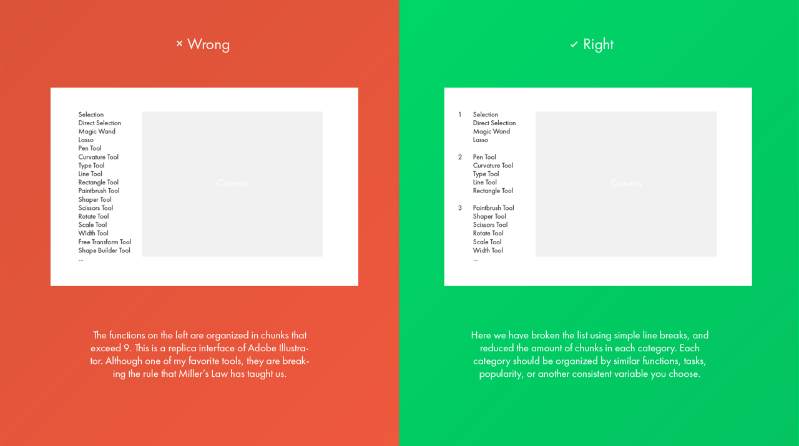


> **Fitts' Law**
>
> 如果物体的尺寸较小或远离主位置，用户需要花更长的时间来指向屏幕上的链接和按钮。  

Fitts' Law的论述似乎是显然的，这会带来交互设计中一个非常重要的理念：

> Fat Finger Problem
>
> 为了让用户快速准确地选择触控目标，触控目标的最小尺寸为1cm × 1cm。  

我们什么时候会对这个问题深有同感呢？我想一定是当你打开App遇到开屏动画时，跳过按钮往往又小又理你的操作手指远，会让你在关闭时十分难以点击，还误触率很高。当然这也达到了开发者的目的，只不过是反向利用了Fitts' Law.

那么在我们正常设计App的交互时，需要让热区的面积足够大，离操作手指足够近，从而减轻用户交互的成本。高德地图App在进入时会让你选择搜索栏在下方也正是为了让搜索栏这一高频点选部位离你的手指近一点、再近一点、


> Hick-Hyman Law
>
> 它描述了一个人根据可供选择的数量做出决定所需要的时间。  

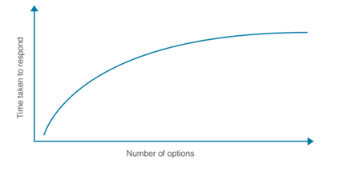

简单来说，Hick-Hyman Law就是交互设计中的选择困难症，我们不应给用户提供过多的选择从而极大地延长了用户选择的时间，降低了用户的体验。


### 交互设计的五个维度

#### Words

字符是用户与交互的第一面，大部分交互都需要文字提示，如“付款”，“搜索”，“点击此处开始编辑”。

在这些字符的选择上，安全且推荐的做法是——与别的App一样，使用经典的词汇。这会让用户能迅速会意且不觉得奇怪。同时，考虑到不同用户的背景，使用尽可能通俗易懂且无歧义的文字。


#### Visual representations

除了文字，还有其他辅助标识，如图标，形状，颜色，背景等等。

对于一些图标，用户会有习惯性的认知，如一个放大镜就代表“搜索”，一个小房子代表“Home"，在我们的设计中也不应打破这种常规。

对于其他也是一样，如红色的按钮往往会让人按下前比较警惕。  


#### Physical objects or space

你的App最终会在不同的终端上使用，因此任何实际硬件可能会带来不同的交互。在PC上可能是通过键鼠，手机上通过点击，等等。

对我们互联网产品开发的场景来说，不同硬件允许的交互是不同的。比如（曾经的）iPhone允许3D-touch；全面屏手机不能从屏幕边缘左滑右滑等等。


#### Time/Animation

声音、震动和动画——当用户与你的产品交互时，你可以采用的所有其他沟通方式。  这些不可或缺的反馈共同组成了交互。

从UX的角度上，这些让用户确保本次的交互是按预期进行的。设想下拉刷新的交互没有任何“正在刷新”的提示，那么用户显然无法知道究竟是正在刷新，还是我操作失误了。在动效的部分我们简单提及过反馈的概念，在后续的章节中我们会展开讲解。


#### Behavior

交互设计发生的形式，任何动作触发反应的流程。  

交互的目的是为了让页面之间产生相互作用，最后一步就是给出结果，如“返回到上一页”，“跳转到某页”，“页面成功刷新”等等。


### 交互设计原则 Principle

正如我们在UX里做的那样，我们需要一些指标来评价某个交互是否是好的。接下来我们给出一些交互设计的原则：

#### Discoverability

交互是为了服务用户的，而可发现性则是指用户能够清晰的发现交互的存在。比如用户一看就知道在这里我应该长按，而不是点击或双击。如果用户感受不到交互的存在，那么再好的设计也是空谈。这里的思想继承自UX部分Learnability和Memorability的思想，如果你可以发现他们的共同点，那么恭喜你，你已经有一定独立思考和内化知识的能力了。

有哪些具体交互是体现了Discoverability思想的呢？首先，大部分的导航栏都是，它简洁明了的告诉你——你可以通过点击去到哪里。以及通过我们常见的按钮来突出存在点击交互的部分。再考虑到Efficiency的思想，如果你可以把最重要或最高频使用的按钮放的离手指更近，那会更好。如果你见过以前的微信支付，高德地图，就会发现他们最重要/高频的功能立即支付和搜索都移到了离手指更近的地方。微信立即支付按钮是从屏幕中央移到了右下角（离你的大拇指更近），高德地图则是把搜索框从上移到了中下方。在手机屏幕越来越大，你的大拇指难以跨过一整条屏幕去到如此远的左上处（对右撇子来说）的发展过程中，这样的思想你可以在许多产品中体会到。

#### Consistency

交互应该具有一致性，设想有两个相同的icon在两个不同的地方，但其中一个是点击触发，其中一个是长按，这时你可能就经常弄混两个不同icon的交互方式。这就是交互不具有一致性的范例。从用户的角度来说，当用户使用你的产品，他会基于常识和先前使用过程了解到的交互来预测其余部分的交互，而我们需要尽力保证他们的预测正确。这里体现了UX的什么思想呢？还是Learnability！

再举个例子，在常见的抽屉中，每一行都是点击，除了有一行需要你左滑。这时当用户知道了其他的每一行都是点击交互时，他自然会猜测——所有的行都是通过点击交互的。而这时遇到左滑，就会造成交互体验的下降。如果这时刚巧他的点击会触发一个意料之外的行为，那么原本的左滑交互就难以被用户发现，并且可能引发存在的错误。从Error Control的角度，我们也要尽力保证Consistency。

为了做到这一点，我们需要尽力保证不同的交互都“符合逻辑”。且一旦你为某种交互选择了一个图标，那么请确保其余的该交互都有类似的图标/布局/动效。

#### Learnability

这里的Learnability是对UX中的思想在交互层面上的细分：我们希望用户在交互上拥有更低的学习成本与更加平滑的学习曲线。所谓平滑的学习曲线，即用户不至于付出较大的成本一无所获，交互的难度应循序渐进。比如大家熟悉的Word，Excel等常用的软件，哪怕你不知道90%的功能。但通过简单的学习你就能掌握基本功能并完成大部分的工作，这就是较为平滑的学习曲线。而想一想Photoshop，仅仅入门你就需要付出相当程度的努力。这就是两类学习曲线的典型例子。相信你很快就能想到——专业性越强的软件，想拥有一个平滑的学习曲线就越难。对PC来说，不同定位的软件为同一功能的解决方案提供了不同的学习曲线适用不同的用户。但对于短平快的移动应用开发场景，这一点就变得格外富有挑战性。

#### Readability

使用手机的过程就是在不断接收信息的过程，这些信息究竟具有如何的可读性？设想你漫不经心地在手机屏幕上扫视，当你没有太认真的看时你会理解多少内容呢？事实上这一点非常的重要，谁也做不到把手机当书本一样聚精会神地看。设想你的App界面就像老师的课件一样密密麻麻，还有谁乐意去长期使用呢。可读性的定义或许因人而异，就像本书一样，有的人喜欢这样事无巨细的介绍，有的人喜欢高度精简与抽象的提纲。而就像我们在Error Control那里提到的一样，我们要尽可能考虑到所有人，不要被过分极端的偏好带偏，进行相关的调研或许是一个较好的方式，在之后产品的工作流中，我们也会详细介绍这部分。而以下列出了一些常见的思考方向：

+ 每页**合适**的的字体，字号，间距与行数。之所以是合适的，是因为这些也要根据具体UI的设计有所思考。
+ Negtive Space的妙用
  + Negtive Space（负空间）是相对于Positive Space（正空间）的一个设计概念。简单来说，正空间是主体部分，负空间就是其他不引人注意的部分，有些类似中文中的“留白”的概念。
  + 前面提到的间距，行距也都算作Negtive Space的一部分。此外，还有图像中的空白部分等。如果您对这部分希望有更深入的了解，可以自行通过搜索引擎更进一步了解


### 硬件交互

这里我们展开说说交互设计的第三个维度——Physical objects or space。

在不同的终端上，我们会选择不同的交互设计思路。对于网页设计，使用键鼠操作是最基本的交互方式。但如果注意到你的网页可能会在iPad上被浏览，那么避免仅有键盘可以使用的交互就十分重要。

对于手机上，不同的手机在硬件上允许的交互也是不同的。Apple的3D-Touch就是一个绝佳的例子，尽管目前Apple由于成本问题放弃了它，但它仍然是许多用户心目中的最爱。大多数手机只能识别轻点与轻按，3D Touch使得手机可以识别重按，在硬件层面上新增了交互的维度。对于交互设计者来说，这允许我们在同样的设计下允许更多的交互方式，给用户带来便捷。

交互设计者也应与时俱进，时刻关注硬件的发展，让自己的软件交互方式与时俱进。如随着全面屏时代的进入，原本从屏幕侧面滑动唤醒抽屉/侧滑菜单的交互就与手机自带的返回手势冲突，那么在新的设计中，就应极力避免类似冲突的手势。

手机发展的趋势究竟在哪里？是类似Surface duo的折叠手机吗？

还有那些与手机息息相关的技术的发展。5G会给App开发提供什么新思路？

虽然手机只是我们App开发的一个载体，但我想多去了解手机本身，也会让我们在开发自己的产品时更加从容。

下面会提供一些相关方面的视频，如果你感兴趣，可以去观看

+ 经典的何同学5G：https://www.bilibili.com/video/BV1f4411M7QC
+ 


### 手机交互

正如我们之前所说的“高频优先“思想，脱离App本身的限制，我们在手机里应用最多的场景究竟是什么呢？其实并不是任何一款App，而是你的手机操作系统。因此，各个厂家会在手机UI上做很多交互的巧妙设计。欣赏下这些不同手机厂商的交互哲学，或许能够帮助我们在App开发中获取灵感。

我们会以一些大品牌的手机UI为例，探索不同厂商的不同交互哲学。我想在看完这些后你会感慨，UI和交互的细节竟有这么多。

**锤子手机 —— Smartisan OS**

尽管锤子的手机失败了，但他手机的UI我想值得我们去探索和思考，其中埋藏着很多小惊喜与小细节。

+ 拨号时，数字5的下方会有一条短划线。事实上这是在实体电话上保有的设计，为了让盲人可以更好的定位到5，也有点类似我们键盘上J和F上的突起。在没有触感的手机上保留了这一设计，算是一个小彩蛋，也是符合手机整体营造的复古感。
+ 在锤子手机的音乐播放器上，你会看到一个很像网易云音乐黑胶唱片的播放界面。这时如果你去拖动碟片，就会产生一些类似真实唱片被这样拖动的声音。事实上，这些声音就是播放处的音乐被处理成类似的音色后的结果。尽管这个功能看起来一点实用性也没有，但也算是一个符合手机复古感的小彩蛋。

如果你想要更多地去了解Smartisan OS的交互细节，可以直接去观看下面的这些B站视频

+ https://www.bilibili.com/video/BV1Wf4y1v7Ba?from=search&seid=15686854936136083340


相比于Smartisan OS, 下面几个品牌相比众所周知，那么这里仅提供一些可以参考的B站视频，如果你感兴趣，可以去看看这些你似乎已经非常熟悉的手机OS里还藏着哪些交互细节吧。


**苹果 —— iOS**

**华为 —— EMUI**

+ 华为Mate30 何同学： https://www.bilibili.com/video/BV1nE411R7CS

**小米 —— MIUI**

【剩女：这里还可以再补一些，但我先去写后面的了】


### 其他概念

综合上述思想，还有一些概念是我们在交互开发时经常会提到的。

#### 反馈感

反馈感指的是让用户的每一次交互都让他有所感知，而不是如盲人摸象般。

第一类反馈概念叫做状态可见，即让用户可以知道自己当前所处的状态。比如当你在浏览器中同时使用多个页面时，你当前所处的页面总是会以某种形式有特殊的标记。这是为了告诉用户你当前的状态（所在选项卡）。以便当用户希望切换状态（切换选项卡）能迅速找到自己当前位置。就像公园或建筑的地图中总会标记你当前所在位置一样。


在不同的场景下，状态可能意味着不同的东西，在刚才的场景中，状态就意味着你所在的选项卡，而对于页面、游戏加载的场景，状态就意味着当前加载的进度。你应该一下就能说出体现这种反馈的交互方式——进度条。通过进度条的长度，颜色等多种方式，可以让用户瞬间发现自己所在的进度。如果你比较感兴趣，可以尝试搜索一下进度条的发展史，在其出现的初期，同样的加载时长，有进度条就能极大的削减用户的焦虑，让用户愿意付出更多的等待时间。

这里简单深入介绍一下进度条，它的设计比你想象的更复杂。你可能会觉得为什么很多次进度条总是卡在99%就不懂了，一方面，有一些技术上的原因这里不做解释，也有一些设计是故意以非线性的方式是的最后1%那么的难走。就以你自己考虑，一个70%进度的页面你可能舍得退出，但99%进度的页面你可能就会想——“再多等一会吧”。此外，有些进度条已经被设计成了小游戏的形式，用于打发等待者的时间，削弱焦虑。小小的进度条竟蕴含着巨大的学问，这也正印证了我们在交互设计中“细节制胜”的思想。


最后一个例子类似第一个例子中网页的选项卡，在手机App中，我们一般叫它Tabbar。在微信中，当你处于不同的状态，会有颜色和icon变化的提示，而QQ采用的方案则是另一套icon、相比之下，你一下就发现QQ的反馈感似乎不那么足，有些显得花里胡哨。事实上，编者个人认为这也是QQ一部分用户流失的重要原因。


第二类反馈叫做操作可见。我们在先前的“动效”中已经提及了一部分，我们可以通过动效来为用户的操作足够的反馈。我们也可以简单些，通过页面的变化，一些提醒的跳出来提醒用户本次交互的结果。没有反馈的交互可能让用户感到迷惑，如登录时输入密码错误却没有明显提醒但是无法提交的按钮，在多个按钮平铺的页面上点击却不知道点到了哪个按钮的场景。

反馈的目的正是让应用与用户之间搭建更好的沟通桥梁，让用户更好的理解App，理解自己的每一次行为。本质上是为了提升我们在UX部分提到的用户的Satisfaction.

#### 用户的等待成本

等待成本是上面反馈感的一个具体应用场景，但他足够常见，所以我们单独提出来说。

在用户使用我们App的过程中，等待是不可避免的，可能是由于网络，可能是用户手机的问题。总之，这是一个我们不可避免的问题，如果用户等待的过久，那么他会在等待的过程中非常焦虑从而影响用户体验。既然我们无法控制等待时长，那么什么叫等待成本呢？可以理解为用户焦虑的程度与等待时长的关系。如何尽量减小用户的焦虑呢？就在上面我们提到的进度条就是一个很好的办法，我们甚至说了故意让最后的1%那么难走缓解焦虑的方法，以及在等待界面添加小游戏等。但并不是所有的场景都适合这样的方法，一般来说，我们会根据用户等待的时长选择不同的应对方案。但总体来说，都是基于反馈的原则，做出不同的反馈方案。

+ 1-2 秒：可以使用一个动效，图标或其他类型的微交互来演示系统正在执行，也就是我们上面提到的反馈感。由于时间较短，只要当做简单的跳转即可。
+ 2-5 秒：只需要告诉他们估计出的等待时长即可。2-5秒的时长一般用户可以接受。
+ 5-10 秒：使用进度条，且进度条应该是准确的，这意味着当进度条完成时，任务必须结束——否则可能会让用户感到困惑或失望。（当然99%并不意味着结束）。相比于一个预计时长，进度条可以更好的显示中间过程，更大程度地缓解用户的焦虑。
+ 10-15 秒：让用户了解进度(通过动画条，小游戏或其他指示器)，并从中获得乐趣。相比于之前，10-15秒已经有足够的时长让用户去完成一些简单的小游戏了。
+ 15秒以上：让用户获得信息和娱乐——但要添加一个显而易见的声音和视觉辅助，这样用户就可以离开你的产品，知道任务完成后什么时候回来。因为如此长的时间我们已经不能奢望用户需要一直停留在我们的App界面上等待。

#### 用户的握持姿势

当我们把之前设计好的种种都放到手机上考虑时，事情又变得有些不一样。不同的人有不同使用手机的姿势与习惯，而这可能也与场景有关。显然，对于不同的姿势，触摸手机的不同位置用户需要付出的成本是不同的。尤其是对最常见的姿势——右手单手握持姿势下，右手拇指的触摸范围更是有限。因此将需要手指交互的地方放在什么位置就成了一门学问。简单的来说就是——离你的手指更近。


## 产品思维

经过上面UX,UI,交互的模块，你已经掌握了如何去把一款产品设计出来。但，我们究竟要做什么呢？

到这里，你才真正进入有关“产品”的篇章。我们会在这里向你介绍如何去构思一款产品。这一部分相比于前面的实体设计略微抽象，也是需要你在长期的经验与感觉下自己总结的。因此，不要全部依赖本书，多去看更多的产品，看更多的测评，多讨论多聊，最终就会形成你个人的独特的产品观。

### 需求导向

在产品的开发周期中，需求决定生产。如果没有相应的需求，那么再好的功能也是白搭。这里有些类似我们在UX部分一开始提到的Useful，即有需要的。

尽管这一点看起来十分简单，但当我们陷入复杂的逻辑，页面，交互之中，整天都在思考UX,UI,交互的时候，就很容易被自己对这个项目过多的了解带偏了方向，而忽视了用户的需求。身为产品经理，我们应时刻以需求为导向，避免陷入自我中心的旋涡。

在一个产品决定去设计UI之前，我们就应该对他的需求进行评估。

+ 用户是否真的需要？
+ 和其他竞品相比，我们满足了什么特殊的需求或解决了什么竞品中的痛点？

确认了这一步后，我们才应该去为它设计UI，设计交互。而不是等到万事俱备后才发现——用户好像并不需要我们的产品。


那么如何确定需求呢？需求本身就是一个主观的事情，你认为重要的可能在别人眼里并不重要，众口难调。又可能有不同的需求相互冲突，这时又该如何抉择呢？解决这个问题的方案之一就是调研：通过广度的调查和深度的访谈，既能够覆盖广度的需求，也能就核心需求调研相关用户的想法与需要。具体的调研我们会在工作流部分介绍。但我们也不能总是依赖调研，毕竟调研需要一定的用户时间成本，高频的调研可能会消磨用户对我们产品的耐心。

产品经理本人应把握需求的大方向，至于如何把握，产品经理确实是某种程度上具有一定个人风格的，在需求的取舍上，就是体现个人思维与能力的一个重要途径。一个普适的方案是不太能存在的，如果有了完全流水线化的评判策略，那么产品就会趋于同质化，缺乏亮点与创新，而这正是当下的互联网产品所需要的。与其期望找到一个严格的规范，不如通过阅读，体验，思考不断提升自己的能力，加强自己对产品的把握力。

以总被大家诟病的微信文件限制100M为例，这一个功能上，用户的需求显然是——需要上传更大的文件。成本可能是存储空间，服务器带宽压力，需要根据具体的技术方案评估，我们无法得知。那么产品经理需要考虑什么呢？

首先需要这个需求是否是个例。在我们身边的大学生群体中，吐槽这个的不在少数，但要知道大学生群体只是整体用户的一小部分，对于其他群体，这个需求是否还显著存在呢？毕竟对于只是用微信聊天的人来说，100M的文件大小限制可能已经够了。

其次这个需求是否紧迫？要知道我们的人力成本有限，无论是公司，你自己开发，或是求是潮开发都是如此。而想要新增的功能是多的，我们是否有必要抽调人力物力去满足这一需求呢？那么你首先会想到不满足会如何。大家也只不过会去使用云盘等替代品罢了，似乎没什么大不了的。如果这时有一个核心功能也在等待人力完成，那么你显然应该主要去实现核心功能。

最后是我们能否满足这个需求。可能需求是好的，也是有必要的，但我们有足够的能力去彻底解决这一需求吗？技术方案上是否支持扩容，需要多大成本。又比如如果要加，100M要加到多少合适呢？用户总是贪得无厌的，今天嫌弃100M少，如果扩到500M，或许也会嫌少……

总之，我不知道他们自己是如何想的，只是如果是我可能会从这些方面思考。最终的结果大家也知道了，100M的文件限制至今仍然存在。

上面一段似乎什么都没说，只是说——需求大多情况下是由产品经理评估的，评估的结果也没有绝对的好或坏。那么我们究竟如何平均呢？接下来我们会展开说说一些常见的评估需求的方式。

**鉴别伪需求**

尽管需求是由用户提出的，但这些需求也未必都是真实的，接下来讲解一个祖传的伪需求例子：

> 学校的附近有一家旅馆，每逢周末就会有很多情侣入住，供不应求。老板问同学们你们是来做什么的呀？同学们说“是来学习的”。老板心想这学校附近的学习需求很大啊，如果我把宾馆改造成学习室，可以容纳更多的同学，那岂不是赚翻，随即动工。但改造成学习室后就无人问津了。

可见，在浩如烟海的需求中，我们也需要去伪存真。


**需求的分级**

我们的产品往往源自一个大的需求，以求是潮Mobile为例，主要是满足同学们校内资源查询的需求。

那么这个大的需求也会被拆分为许多小的需求，如：查询课表，查询校车，查询考试时间，等等。

小的需求往往是浩如烟海的，我们需要对需求进行分类与分级，评估各需求的重要性从而分配不同的资源。一方面是我们的人力资源，我们安排更多的开发者去解决重要的需求，另一方面也是我们UI设计上的分配，对高频的需求需要更显著位置。

在Mobile的例子中，一眼就可以看出查询课表就是我们最重要的需求，它足够高频，每次上课前都要看，也足够有竞争力，以App的方式相比于教务网查询节约了大量的步骤。同时围绕这个需求，我们可以扩展需多功能，如距离上课/下课时间的提醒，


**广义的需求视角**

当你把需求视角推广到生活中，也会为你带来许多。生活是有无数的选择构成的，当我们面临选择的时候，想清楚自己的需求是什么再做决定。小到为自己选购一台电脑，大到学习，专业，去向这样人生轨迹上的选择，都可以帮助你许多。


当你每做一个决定，产品上或生活上的，请问自己一句——究竟是为了什么，是否会有用，这或许能时刻提醒你牢记以需求为导向。能让你更好地掌控自己的产品或生活。


### 知识产权、监管

身为面向市场的产品经理，我们不再是做“玩具”，而是做真正面向市场的产品，因此我们要尽早养成严谨的态度。

其中包括注意知识产权，在产品开发的过程中，时刻注意避免抄袭。注意引用对象的协议，我们能否将网络上的资源用于自己的产品，如icon，代码片段，设计思路等。

考虑到我们的产品将在市场上发行，也需要遵守发行方的要求。如你是开发微信小程序，则要遵守微信小程序的规定；开发的App上架各应用商店需遵守各应用商店的规定。

值得注意的是，在具有社交性的产品中，需要注意用户发表的言论是否合法，这需要我们在相关用户提供公开内容的功能上注意监管与审查机制。与求是潮产品最相关的可能是box面对用户上传非法内容的情况。

平时自己设计的“玩具”距离可上架的产品还有着极大的距离，建议在选择好产品形式，如小程序，App，插件后，去对应的上架途径搜索相关的注意事项与法律法规。


### 信息安全，用户隐私

维护信息安全的方式主要由技术方提供，如对数据的加密、不在数据库明文存储密码，防止sql注入攻击等。

但作为产品经理，我们应敏锐地注意到哪些数据的安全性应额外注意。例如产品核心数据谨防泄露，用户隐私数据谨防泄漏等。


## 产品迭代

在前面的讨论中，我们已经知道了如何从0开始构思一个新App，并且结合UX,UI,交互为其设计界面。然而多么严谨的前期设计都有可能在上线后出现问题需要我们更新，抑或，我们自己需要对某些功能进行更新。当一个产品上线以后，所有的更新我们都称之为迭代过程。

产品的迭代与开发有什么不同呢？有哪些额外的注意事项呢？本章将主要讲解这部分问题。

### 数据驱动

想要找到产品创始与产品迭代的不同，首要的思路自然是想想迭代中的产品与开发中的产品有什么区别——第一个最大的区别自然是迭代中的产品已经有了真正的用户使用。如何利用这个额外的信息帮助我们更好的迭代呢？首先我们需要以某种方式获取到用户的数据。

你所能想到的最基础的方法应该是

+ 问卷

  + 我们在App中的某些地方以问卷的形式让用户主动的提供数据。比如美团饿了么的五星好评等，这些是由用户主动提供的数据。


而如果你想需要更多的信息，全部依靠问卷显然不太可行。这时我们需要通过**“埋点”**的方式主动的搜集用户的信息，相比于前面的问卷数据，这部分数据是用户被动提供的，即用户使用App过程中无意提供的。尽管我们是在迭代的部分里讨论这一个问题，但在开发时，这些点就应该埋下用于后续产品的迭代，当然，也可以是用作其他用途。

那么什么是埋点呢？比如说，你想知道用户访问某个页面的次数有多少，你不可能指望用问卷让用户每登录一次就填一下，这就需要我们在开发App的过程中有意识的统计用户登陆的次数。具体的技术细节这里不多解释，你只需要知道——这是可以做到的。

埋点的数量可能会很多，需要你精心设计，记录下那些有价值的数据。基于这些数据，你就可以通过数据分析与数据挖掘来更科学，精准的指导你的产品迭代。

举个例子，如当你浏览淘宝的时候，后台已经记录了你浏览商品的数据，再通过大数据算法向你精准推荐你可能会喜欢的产品，这部分埋点数据是用于功能本身的。类似外卖软件的五星好评数据，这部分数据也是用于外卖员调度等产品核心算法上的。

但如果是记录淘宝每个页面的访问人数，可能就会作用于我们的产品迭代。如我们发现某个页面的访问人数非常的多，我们就可以考虑在交互上提前这个页面，让用户能更快捷地进入该页面。用于产品迭代数据更直接的可能是大部分产品中设有的反馈渠道，如向开发者发送邮件等类似方式得到的用户主动提供的数据。

稍作总结，获取数据的方式有两种

+ 用户被动提供
  + 是开发者通过埋点记录用户使用App过程中的数据
  + 这部分数据对用户是无感的，即用户可能并不知道自己的这些数据被收集
+ 用户主动提供
  + 使用开发者提供的问卷等形式，可以是类似反馈信息这类固定的渠道，也可以是类似问卷星每填完一次后询问你是否要为了产品迭代提供体验数据的问卷
  + 这部分数据一般是被动方式难以提供的

提供的数据的用途也有两种

+ 用于功能的算法
  + 如外卖员调度，淘宝商品推荐
+ 用于产品更好迭代

说到这里，你一定会意识到，这不就是我们平常说的App非法收集用户数据吗，这也引出了我们接下来要说的数据安全问题。

结合我们上面刚刚提到的信息安全，用户隐私。首先涉及收集用户数据的部分，我们应当有用户须同意的协议，让用户知晓我们收集了哪些数据并作什么用途。（一般来说似乎就是大家不看就勾的每次安装App过程中需要同意的那部分文字）。

另外，我们也要保护这部分数据安全，同时合法地使用这部分数据。


## 具体的平台开发

先前的UX、UI、交互、产品，都是对于产品开发这一整体而言的。最终我们往往需要选择平台去落实我们的产品，如使用App的形式，抑或网页，抑或微信小程序。不同的平台具有不同的优劣势，接下来我们会大概介绍一下各个具体平台开发的注意事项。

### App

手机App是较为常见的一种形式，分为我们比较熟悉的Android和iOS两个生态。

手机App的优势自然是可以实现的功能较多，开发所受的限制也较少。

劣势是用户需要安装App后才能使用功能，在产品的前期推广和用户留存上可能较为麻烦。

Android和iOS几乎是完全不同的两套开发方案，他们具有各自的开发语言与工具，UI标准。

|          | **Android**      | **iOS**      |
| -------- | ---------------- | ------------ |
| 开发语言 | Kotlin/ Java     | Swift        |
|          | 安全性相对较低   | 安全性高     |
|          | 获取权限相对容易 | 获取权限复杂 |
|          | ……               | ……           |

在设计规范上，二者有各自的设计规范，这点从两个平台上App的设计风格就能有明细的感受。其中Android使用我们本书在UI部分提到的Material Design。iOS设计规范下的App视觉上更加简洁明快。你应该去直接观看官方提供的设计规范手册来获取相关的知识。

### 网页

网页开发的优势是无需用户下载App。

劣势是随着目前互联网的发展，人们大部分场景都会使用手机完成，而手机上的网页相比于电脑上的体验就不是很好了，尤其是如果你的网页没有做手机端的适配，但适配会极大地增加网页开发的成本。

同时网页的功能上比较受限，如他无法本地缓存用户数据，设想把Mobile的功能移植到网页上，那么用户每次查询都需要输入自己的信息才可以，显然就没那么适用了。

一般来说，对于PC场景下的功能，如选课助手，使用网页的形式会较为适合。如果是移动场景下的产品，那么显然App会更加合适。

值得一提的是，网页也是可以嵌入到App中的（如果做了手机分辨率的适配）。


### 插件

对于已经使用过选课助手的大家，对插件并不陌生。网页插件是你在你浏览网页时提供辅助功能的。

合理地使用插件确实会提高我们浏览网页的效率，如大家常用的页面翻译插件等。你可以去你使用的浏览器的插件商店稍做浏览，如果你是Chrome，那么需要科学上网才可以浏览插件商店。

插件这一形式较为简单，限制也十分明显，必须依赖于特定的网页才能发挥他的功能。相信在浏览并使用了一些插件后你会对插件这一形式的特点有足够的了解。


### 微信小程序

微信小程序是近些年来微信推出的新的产品形式。他的好处毋庸置疑，依托微信这一人们日常就使用的社交工具，推广，使用起来较为方便。限制主要是小程序本身的一些规范限制，如不能在小程序中出现外部链接等，具体的可以翻阅微信小程序开发者文档。

在形式上小程序与App比较接近，差距也不大。因此你可以看到市场上很多产品都是既做了App版本也做了小程序版本。不过体验上可能有些一言难尽，小程序的页面管理相对混乱，一般来说功能上和体验上小程序都没有App端好。不知道是否与腾讯有关，许多产品分享到微信后只能打开小程序版本，这也十分令人恼火。

如果你计划同时做App端和小程序端的产品，请想好两个产品的定位。

事实上，求是潮Mobile也有小程序版本，但考虑到可能会分走App流量且体验上欠缺目前暂未开放。


## 求是潮产品线

求是潮创立于2001年，最早就是一个面向校内的网站，逐步发展成为有着资讯、教育、服务、休闲、网视五个子网的校内门户网站。在2010年代之初，求是潮经历一次比较大的改组，逐步由按子网分类转向按职能分类的工作模式。自那时求是潮产品运营部门诞生，至今十年左右的历史上诞生了许多产品，它们有的已经光芒淡去，有的能够长盛不衰，有的尚是含苞待放。

“以史为鉴，可以知兴替”，所以，有必要在此对求是潮产品线做一个梳理。

### 历史

**上古时期**

我们无法找到求是潮网站最早的代码或图片等资料，就从门户网站说起吧。

所谓门户网站，是指提供某一类综合性互联网信息资源并给到入口（即“门户”）的网站。诞生之初的求是潮产品和其中几个子网联系是比较密切的。

教育网：提供学习资源的子网，“Share”的前身。

休闲网：提供片源、音源等资源，与“Bubble”联系紧密。

服务网：有吃在浙大、信息总汇等栏目，在这里诞生了“问答堂”。

**前事不忘（凉掉的产品）**

在这一部分，我们会讲述求是潮产品历史上不幸倒下的产品们，当然，不排除有产品已经消失得没有痕迹，这里只能选取能找到资料研究或是有口耳相传故事的产品。最重要的是，从它们身上吸取教训。

**吃在浙大？**


**问答堂（Ask）**

2005 年，著名的在线问答网站**百度知道**建立。一年之后，为了为同学提供更为方便快捷的服务，求是潮服务网提出了“建立浙大自己的‘知道’网站”的构想，并很快将之变成现实。2007 年，经过一年的内测，浙大人自己的在线问答网站**问答堂**正式面向公众开放。

当时浙大的同学可以在问答堂上享受高效的在线问答服务，提出的问题很快就能得到回答和解决。问答堂一时受到广泛的欢迎和好评。提供答案的有乐于助人的站外同学，也有服务网内部的工作人员。除此之外，问答堂还开展了各种各样的专题问答活动，譬如选课指导，考前教师在线答疑等等，又将它的受欢迎程度推上了一级更高的台阶。如图所示，是当时的问答堂网页截图。


然而好景不长，到了2010 年，服务网的新任总监冯庆斟酌再三，下令关闭问答堂栏目。根据BBS上能找到的资料，我们找到了当时问答堂关停的原因，并且会站在今天的角度做进一步的分析。

1. 访问人群单一

指问答堂用户画像主要是浙大在校生，且以大一、大二学生居多，而不像其他互联网产品有着各年龄圈层和职业，导致了提问的局限性和回答的局限性，进一步限制了对新用户的吸引力。

当时的问答堂也通过开展专题问答、选课指导、考前教室在线答疑等专题试图弥补该弊端，但终归只是权宜之计，相对高昂的运营成本难以持续。

站在今天的角度，求是潮现在也不乏局限于浙大学生的成功产品，但它们都不要求由用户主动提供内容，某种程度上，扩张、出圈是这类产品生存的必要条件，否则就只能逐步衰亡。

2. 问答堂里的提问频率不及从前

这是所有在线问答网站的通病。随着时间的推移，常见问题逐步被解决，用户可以通过搜索就得到答案，当然从用户的角度来说这没有问题，但如果不从根本上解决这个问题，问答类产品走向衰落只是时间问题。

今天来看，“知乎”已经突破了简单问答平台的局限，走向了更广阔的内容生产平台道路。具体而言，虽然有的内容生产以问题的形式出现，如“给诸葛亮100万名大学生他北伐能成功吗？”，但这个问题的问答本质已经是虚构类文学作品创作。

另外，当时的总结还提到不少同学更喜欢在浙大CC98 论坛上提问，论坛本身的活跃气氛也促使同学们投奔CC98。今天朵朵校友圈同理，虽然用户可以通过它们进行提问得到解答，但它们的产品定位并非相对单一的问答类产品，更广泛的定位让这类用户原创内容类（UGC）产品有更大的空间。

3. 缺乏有效的用户激励机制

实际上，当时的问答堂也有回答问题奖励积分、最佳答案获得悬赏分的制度，然而问答堂的积分非常空洞，没有实际用途。虽然自设立之初就有积分兑换实物奖励的计划，但由于经费问题从未实现过。

另外，据当时的部分潮人分析，服务网人员在回答问题方面的“垄断”也是造成其他同学回答问题积极性不高的一个原因。工作人员的回答由于具有很强的规范性和非常让人愉悦的礼貌用语，被提问者选为最佳回答的几率非常高。相比之下，其他同学认真回答的问题也很难得到提问者的认同。

4. 广告太多

问答堂的广告无法完全过滤，只有靠管理人员手动删除，工作量非常大。问题背后的根本原因是求是潮仍然只能算一个小的开发团队，过高的运营成本对于我们来说绝对是不现实的。

今天我们不能得知具体是哪类广告，但类似的运营成本问题问答堂绝非孤例，后来还有产品”重蹈覆辙“。

总的来说，随着时间推移，问答堂的运营成本逐渐升高，用户活跃度逐渐下降，同时产品定位制约了问答堂的进一步发展，最终被时代淘汰。

问答堂关停后，当时计划是从题库中精选出经典问答做成Q&A 的静态网页，继续为同学们提供帮助，没有复活的计划。最终静态网页是否做出来不得而知，但这十年来直到今天，我们确实得承认，那样的“问答堂”，没有在求是潮生存的土壤。

资料来源：【问答堂】问答堂遗迹考察团开工了！https://bbs.zjuqsc.com/forum.php?mod=viewthread&tid=38743(出处: 求是潮工作论坛)

**Bubble**

早在子网“休闲网”时期，就不乏一些优秀的音乐电子资源分享，可以想象的是，一个个去收集下载这些资源无疑是什么麻烦，在线即听的需求非常迫切，2009年Bubble开始开发，2010年4月，Bubble上线。

Bubble一度非常火爆，后台曾有因为Bubble流量过大，导致出口服务器带宽紧张，无法访问的紧急通知帖。据我不准确考证，似乎2010年4月4日因为Bubble求是潮网站的DPV（日页面访问量）从一般的5万激增到7万左右。


如图所示是当时Bubble的页面，可以看到Bubble具备基础的在线听、收藏、分享、下载等功能，同时支持风格均衡器修改。值得一提的是泡泡数和泡心情，泡泡数似乎来源于用户听歌时间的积累，泡心情则允许用户发表听这首歌的感想和查看别人的评论。


**Share**


Share是求是潮推出的在线资源分享平台，有点类似如今的[zju-icicles](https://github.com/QSCTech/zju-icicles)，是同学们交换学习资源的平台。该服务于2019年被关停。关停的原因有以下几点

1. 知识产权问题

   用作分享的资料很大一部分是老师的课件，然而有相当一部分老师是不愿意自己的课件资料在网络上公开的。

2. 用户积极性与激励问题

   作为一个用户，白嫖的心态远远大于贡献的心态。因此在Share上贡献资料的用户越来越少。到了Share生命的末期，为其提供内容的只有潮人们，当时每逢考试周前产品的一项重要工作就是每个人往上放一些资料。这样畸形的运营模式是Share灭亡的一个重要原因。究其根本，用户缺乏有效的激励来向上提供资源，而这一问题也是前面几个求是潮凉掉产品的普遍问题。我想在未来的很长一段时间里，这个问题都会阻碍我们开发用户提供内容的社区类产品。


**Notice**

Notice是如今产品Notify的前身，只不过是以网页的形式。为了解决的问题也是校内信息繁杂，信息来源太多这一问题。Notice聚焦于组织社团信息，邀请各组织社团入驻，将自己的活动信息发布在Notice上，这样用户可以在Notice上搜索自己感兴趣的组织社团活动并参与，同时对组织社团的活动还能起到推广的作用。

Notice于2019年正式下线（也没完全下线，如果想开还是可以开起来看一看），凉掉的原因有下

1. 维系组织社团

   某些组织社团内部存在传承断代的问题，随着几年过去，一些组织社团内甚至忘记了自己的Notice账号密码。

2. 组织社团发放消息的积极性

   组织社团会忘记在Notice上发布信息，导致Notice信息不全面。在当时的运营模式下，每个产品小朋友会有负责的几个组织社团，关注他们的公众号，每当他们出现新活动就催他们放到Notice上。而这样仅靠人力维系的机制是无法在各个组织社团，包括我们都存在传承问题的情况下长期高效维持的

 3. 用户对Notice的信任问题

    从用户视角来说，我上Notice是为了获取所有的组织社团信息。而由于前述的问题，Notice是无法保证所有信息都完善。这时对用户来说，既然Notice没法保障信息完整，那么我还是需要自己去公众号等途径确认信息的完整性，那我不如从一开始就不用了。

	4. 缺乏运营与推广

    对上述问题没有有效的运营方案解决，同时新生入学时的产品推广效果不佳，导致Notice用户不断流失，最终凉凉。

Notice的经历对我们开发信息板类产品具有十分的借鉴意义。至于Notice怎么变成Notify的，我们会在Notify部分讲解。


### 启示

观察以往产品的失败历史可以让我们少走弯路。

尤其是Share对于用户内容提供类产品，Notice对于信息聚合平台类产品具有十分的借鉴意义。


### 现在

作为求是潮产品的一员，我们的家底你总该清楚。这部分会告诉你我们现有的产品和概念中的产品以及他们的由来。

#### 运营中产品

**BOX**

**求是潮手机站**

Android and iOS

**Enroll选课助手**

**ROP求是潮纳新开放平台

**求是潮主站**

**Notify**

Notify是一款聚焦校内官方信息的聚合平台产品。

他的前世今生还是要先从Notice说起。作为敏锐的产品经理，你一定意识到尽管Notice失败了，Notice着眼的需求仍然是十分有意义的。

需要聚合的信息可以分为两类，一类是Notice关注的组织社团信息，这部分信息在2019年计划通过社团平台（概念中产品会提及）聚合，另一类就是官方通知，Notify则着眼于这一类信息，希望做成校内通知的信息聚合平台。

改变了信息的种类会有什么改变呢？

1. 官方信息具有固定的发布途径，无非是各大官网，来源固定。
2. 官方信息以文字为主，同时都以网页形式发布，管理起来较为容易。
3. 以上两点使得官方信息可以通过爬虫爬取，而无非人力输入，这解决了Notice核心的信息完整性与积极性的问题

Notify的产品定位是校内通知信息的聚合平台，面向用户则是在校学生。

核心逻辑是订阅制，用户订阅通知来源方，Notify会向他推送订阅的消息。同时有对通知进行相应管理的功能。

核心功能是对通知的分类，爬虫爬取来的通知直接分类较为困难，目前可以采用产品人手动打标的方式，未来可以引入神经网络预处理打标。


**QSCamera**

QSCamera是由视频部门沈吕可晟自行开发的视频部门器材管理小程序，后交由产品部门运营维护。

**新生手册**

**考试系统**

新生手册考试系统


#### 潮内产品

**BBS**

**人资系统**

**求是潮通行证**


#### 概念中产品

**社团平台（潮Club）**

想法由2019年中管提出。

上接Notice的通知，Notify解决了官方通知的信息聚合，社团平台则是希望解决校内组织社团信息混杂的问题。

我们通过以下手段解决原先Notice存在的问题

+ 融入ROP的纳新功能，从而绑死使用求是潮ROP纳新的组织社团。纳新会带来巨额的流量，让新生知道该平台的存在。同时集合纳新会为各组织社团带来好处，可以帮助他们推广纳新，按设想，各组织社团的积极性会在纳新期间有所提高。
+ 融入纳新环节为社团平台带来了第一波流量，如何将这些流量在日常生活中维系又回到了Notice的老问题。新平台的定位不能只是通知发布，应当是各组织社团入驻制。作为某些组织社团（如我们自己）的日常活动发布处。这需要我们联合一些较大的组织社团，如社联校会。当校内一些较大的活动都依托此平台时，大家自然会缓慢接受。
+ 功能的丰富化，除了提供单体活动的信息，可以以类似公众号的模式运营，可以让用户跳转到社团组织的详情或其他活动。同时允许用户在本平台上报名。将更多的功能挂载在本平台上，用户就有更高频的机会去看到通知，达到良心的正反馈
+ 如何长期运营与维护组织社团传承？首先必须以求是潮产品为主体，不能指望别的组织社团会自动传承，这会赋予我们更多的工作，但也是应该的。由于我们是入驻制，只需要维系大的组织社团即可，某种程度上节约了人力物力。对于大组织社团的维系，目前设想还是采用人力同步，即对大型的活动由我们去主动提醒他们平台上的合作事宜。举个例子，如十佳歌手开始前，我们就应该联系校会确认平台上发放通知的事宜，同时确认通过我们的平台报名等细节。校内举办的大型活动不太多，稍加列举看起来只有——求是潮的活动（潮汐音乐节，网节，记者节），校会的十佳歌手，新年狂欢夜，社联百团大战等。把这些重要的活动留存住即可。

该项目很多想法只是设想，包括上面提到的一些解决方案，不能确保一定行之有效。同时整个社团平台的构想过于宏大，人力资源有限，故目前仍然是概念产品。


**Wiki**

想法提出于2019年workshop.

Wiki是协作的写作系统。我们的设想里，可以构建浙大特有的Wikipedia，有点类似校内百科。

Wiki只是一个载体，他可以用作很多用途。

如为每个老师创建词条，我们就可以达到类似査老师的作用。他也可以实现资源存储，如把新生手册存储在“新生手册“词条下，等等。

Wiki更像是玩的一个彩蛋，谁也料想不到会有什么有趣的词条出现。可能是知识性的，可能是分享性的，可能就是娱乐性的。

Wiki有以下几个核心难点

+ 编辑Wiki对技术来说很容易，但对一般校内同学来说可能过于复杂。甚至对于产品小朋友来说也需要一定学习后才能学会如何编辑Wiki
+ Wiki初始信息的积累。想要让Wiki吸引广大同学来编辑，首先我们需要有一些内容引导大家，这部分初始的搬运工作只能依赖产品的同学完成。

Wiki是一个非常有趣的产品，但上面两个痛点实在过于显著，这也是它目前仍然是概念化产品的原因。

Wiki的部署十分简单，当时鱼丸一天晚上就部署好了，因此思考Wiki的定位，想一些有趣的词条内容并开始搬运，或许浙大Wiki很快就会流行起来。


## 工作流

对于看到这里的小朋友，相信你们已经理解了需求、交互、UI、UX等基本概念。如果你对这些内容仍感到生疏，那么建议你回顾一下前面的部分，后面的内容可能对你的帮助相对较小。

在这一章中，我将具体详细的描述一个产品从0到1的出现需要哪些过程，产品运营部门都要做些什么。在这之后，我会对一些应用较为广泛的工作流程，比如瀑布流开发、scrum敏捷式开发等作出一些粗浅的介绍。

### 产品是如何工作的

#### 调研

开发产品的第一步一定是在不考虑具体UI和交互的情况下，对产品性进行评估，主要是我们之前提到的需求分析

+  需求明确：产品具有明确需要解决的现实问题，有明确的目标用户和使用场景；
+  概念创新：在产品形态或对传统产品形态的互联网化改造方面有所创新等；也可以理解为相比于目前的竞品有核心竞争力与优势。
+  贴近实际：为用户生活带来便利或具有商业价值。

分析清楚这些需求，除了依赖产品经理个人的判断，调研往往也是必不可少的。

对于产品来说，建议你先和伙伴或中管仔细商量这一想法，明确其定位，功能，场景，并且调研竞品，做**竞品分析**。等待这些都比较完善后，再去对用户进行调研。

#### 需求文档（PRD, Product Requirement Document）

PRD可以帮助我们厘清产品性。需求文档并没有明确的定义，它是产品经理与设计师工程师的桥梁，只要能让设计师和工程师明白我们的意图就是好的需求文档。

在那之前，我们需要先撰写产品相关的内容，一般来说可以由以下部分组成

+ 需求背景与产品定位
+ 如果有调研，展示调研结果
+ 用户画像
+ 需求分类与分级
+ 产品功能说明
+ 产品结构
+ 如果有竞品分析，展示结果

以上的部分是产品的基础信息，到这里，我们还没有进入和设计师工程师合作的部分。接下来我们会具体讲讲这些部分都意味着什么。

“产品”部分，其实就是指一个项目从0到1的出现过程中，一个产品经理要做的事情。如果要我简单的描述一下，那就是一个项目除了程序与绘图以外的所有工作。这些工作是极其重要的，他们显著的影响着用户体验，也决定了我们项目的生命力。那么一款产品的创造过程，我认为可以分为“概念化”和“图纸化”两个阶段。

##### 概念化

现在是星期一上午七点四十八，你赶到了教学楼楼下。还有十分钟你的早课就要开始了，不幸的是，你忘记了早课的教室。于是你打开了浏览器，输入教务网的网址，在教务网中，你找到了这门课的地点。这个过程花费了你足足十分钟，以至于几乎在铃声响起的同时才踏进教室的后门。下课后，你开始想，为什么需要不断的去教务网上来查询自己的课程地点呢？

对我们有所了解的同学们应该已经发现我指的是“mobile”了，但让我们回到这个情景中来。中午吃饭的时候，你的室友和你吐槽，今天第一节课竟然是九点五十的，被我记成早八了，害得我白白浪费了一个小时的睡眠时间。这时一个想法在你脑中有了雏形：为什么我不自己做一个能够从教务网爬取我的课程信息并展示在课表上的app呢？不过很遗憾，大多数朋友不具有独立开发一款app的能力。于是你找到了一位懂技术的朋友和一位画工精湛的朋友和你一起来完成。你与他们分享了你的idea，但他们不置可否。因为他们并不知道你究竟要做什么，以及做完会有什么样的效果。

或许我举了一个粗糙的例子，不过上述的过程就是一个idea的产生。这是一个产品最初始的步骤，它就是一个种子，决定着你的东西未来会什么样子。但它也只是一个种子，并不能吸引别人帮助你为它浇水施肥。

###### 产品定位

对于一个idea，我们首先要明确的是它的产品定位。产品定位是一个极其重要的事情，它值得你花费极大的精力去思考。设想以下的这个情景，用户想要你设计一款能够帮助别人计算数学的软件。你查阅了大量的资料，设计出了能够帮助运算张量、计算拓扑数的程序算法。骄傲的交给了客户。客户看完大开眼界，然后问你“我的老婆算这个月的开支是不是用不到这个”。这样的偏差，会极大的影响你的工作热情，会导致你事倍功半。

下面我给出我对产品定位的理解：我们这款产品要以什么样的方式重点满足哪种用户的哪些需求。这个问题包含了三个维度。“哪种用户”代表我们要找到核心用户群，比如“mobile”就是面向浙大的学生。“哪些需求”代表我们要找到核心需求，比如“notify”解决的核心需求就是快捷的查看自己感兴趣的学校通知。“以什么样的方式”就是指衡量我们目前已有的能力和成本给出的最优方案，比如“notify”就考虑到工期与人力资源而给出小程序的解决方案。

在给出这个产品定位的过程中，就要求我们有两种视角：其一为“用户视角”，站到用户的利益去思考，把自己当作真正的用户，看我们的产品能为用户解决哪些问题。其二是“业务视角”，站在组织的角度，看到这个项目能给组织带来哪些收益，例如：用户量/日活等等。从职能上讲，产品经理是一个团队里唯一为用户考虑的人，但这不代表产品经理要严守着用户体验不退步，这需要与团队其它人沟通，这方面相关的内容在下一部分有所介绍。

那么为了得出一个令人信服的产品定位，要有以下的思考。首先是贴近用户，就是我做这个事情的原因是因为用户的声音。其次是遵从数据，我做这个事情有数据的支持。如果我们能够构思出一个产品最终成品的样子，再过来看我们最初的样子给出的结果，就会更加容易使人信服。

###### 竞品分析

为了能够建立一个合作的团队，我们通常需要说服别人与我们一同立项，这个时候除了一个准确的产品定位以外，一些分析的内容就极其有必要了。一般来讲，我们要辅以专业的调研。调研相关的内容前面已经有所介绍。我们现在说另一种分析方式——竞品分析。目前app市场上有大量的软件，Google Play应用商店上有三百万个应用，想让用户看到你的app都很难，更不要说下载使用了。那么在立项之前，对市场做充分的分析就是极其重要的了。

要完成一篇好的竞品分析，首先要找到合适的竞品。找合适的竞品的方法有很多，不过我们需要关注一些重点。我认为最值得我们关注的竞品就是用户经常谈及的竞品。用户有时会在应用平台的评价上面或者反馈渠道中提到他们喜欢的其它产品，那么这些产品就是我们需要关注的重点。除了用户以外，媒体也是一个极其有效的渠道，如果我们关注合适的媒体网站，会发现不少竞争对手，关注他们的资讯会帮助我们更加了解他们。

在确定好竞争对手后，我们可以通过列表来让局势更加清晰。我们把可能的竞争对手列在纵向，横向上列出我们希望对比的维度，比如：类别、平台、背景、目标用户、主要功能、关键的用户体验、关键的痛点。这一部分做的越详细，就越有助于我们后续工作的整理安排。

下面介绍一种有体系的竞品分析方法——$APPEALS。这种分析方法是IBM给出的一种分析用户需求的方法，将其运用到竞品分析上可以多维度的给出产品对应的价值

| 符号 |      对应单词       |     释义     |                     细分项目                     |
| :--: | :-----------------: | :----------: | :----------------------------------------------: |
|  $   |        Price        |     价格     | 可生产性、原料、技术、供应商、管理费用、人力成本 |
|  A   |    Availability     |   可获得性   |  渠道、销售、广告、交货时间、个人定制、配置要求  |
|  P   |      Packaging      |     包装     |    设计风格、UI方案、视觉评估、集成性、模块性    |
|  P   |     Performance     |     性能     |            功能特征、速度、功率、容量            |
|  E   |     Easy to use     |     易用     |   用户体验，学习成本、个性化显示、直观性、舒适   |
|  A   |     Assurances      |     保证     |         可靠性、安全、质量鉴定、后期服务         |
|  L   | Life circle of cost | 生命周期成本 |     安装成本、培训成本、折旧、迭代、处理成本     |
|  S   |  Social acceptance  | 社会接受程度 |    口头言论、评价、政府或行业的标准规定、形象    |

进行这样的分析的第一步就是通过调研给出各个维度的权重，我们要找到用户对那一方面比较重视。同时在进行这样的一个分析的时候，也不是所有的维度都是必要的，比如在我们求是潮的分析中就可以忽略掉价格的因素。此外，在一个项目的不同阶段，需要考虑的重点也会迥然不同。比如在一款产品刚上线的时候，我们会更关注可获得性、易用、包装等。但当产品已经上线处于维持阶段的时候，性能与保证就会成为更重要的因素。而对其进行迭代更新的时候，生命周期成本、社会接受程度就要受到更多的重视。


##### 图纸化

确认以上部分无误后，我们需要用学到的UI,UX,交互设计思路设计具体的页面和页面之间的关系。不仅要让我们自己清楚，同时也要让设计师和工程师能正确get到我们的意思，这就需要我们通过一些手段尽可能详细地描述给他们。

###### 业务逻辑

业务逻辑是图纸化的核心概念。首先要明白，什么是业务呢？

简单来说，就是我们产品需要实现的功能。如淘宝的业务就是用户的网上购物。业务是一个很抽象的概念，我们的产品究竟是如何满足用户网上购物的需求的呢？这就是业务逻辑的重要性，业务逻辑就是**功能到代码上的映射**，即我们怎样去实现我们的业务。

一般来说，业务逻辑由**数据**和**逻辑**构成。

数据就是在我们的产品中，需要记录哪些数据？

以比较简单且具有代表性的ROP为例：

首先我们要记录组织里的人员，如求是潮有哪些人。这里就可以引出业务逻辑设计的第一个要点——**眼光长远，有扩展性**。如果你在设计这部分数据的时候考虑到，未来可能有别的组织入驻，这里可能要记录别的组织人员信息，工程师在设计数据结构的时候就会考虑到这一点，让数据结构允许这部分的扩展。

其次，我们需要记录一张又一张的报名表信息，并且记录填写了这些报名表的人员的信息。

同时报名者可能会处于不同的状态，如一面中，二面中，已拒绝，已通过。

除了这些数据，我们还应该注意到这些数据之间的关系，如一个用户可能会报名多个组织，一个用户只能报名一个组织一次。这些“一对一”，“一对多”，“多对多”的关系也是数据的重要组成部分。


接下来就到了**逻辑**部分，逻辑主要控制数据的走向，如如果我们拒绝了一个面试者，面试者的状态就会变为“已拒绝”，类似的。

我们需要把每一个功能映射到具体的数据走向上，这样就完成了我们业务逻辑的设计。


这部分的内容已经比较偏向数据建模与后端开发，如果你无法搞清楚这些部分也没有关系，只需要帮助工程师理清思路即可。但你应当知道，在如今的成熟公司中，产品经理大多由退役程序员担任，有一定的开发经验，这部分的设计也确实能帮助我们在产品落地的过程中少走弯路。学习这部分知识的方法也很简单，去随意搜索任何一个开发课程，如Android开发，iOS开发，网页开发，稍微学习几节课，只需要完成一些基础代码的编写，你就对这些部分之间的关系和逻辑会有比较清晰的认知。


###### 页面逻辑

+ 展示产品的核心页面组成
+ 对于某一功能流程来说，页面的跳转逻辑如何，以下是一个示例图

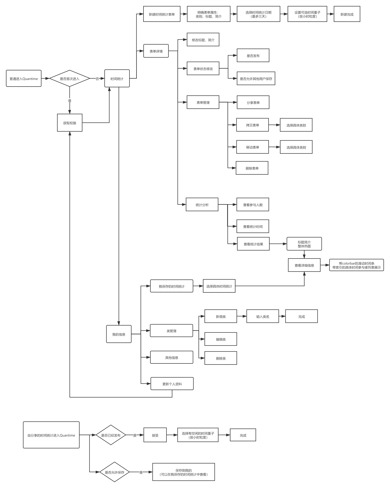

页面逻辑展示了你各个页面之间的逻辑关系，一般来说就通过上面的流程图形式展示。同时也从用户视角展现了，当我们需要完成某一功能的时候，使用的逻辑是如何的。 

在这个部分，如果你的产品设计多个角色(role)，你可以分别展现这些角色视角中的产品流程。如用户视角的，管理员视角的，等等。


###### 数据通路

当你的产品涉及比较复杂的数据传递时，用流程图的方式展现数据通路辅助说明业务逻辑是十分有必要的。他可以帮助工程师弄清楚产品中数据的走向是怎么样的，如果你略懂一下前后端，分离前后端的行为会更好。

以下为两个例子

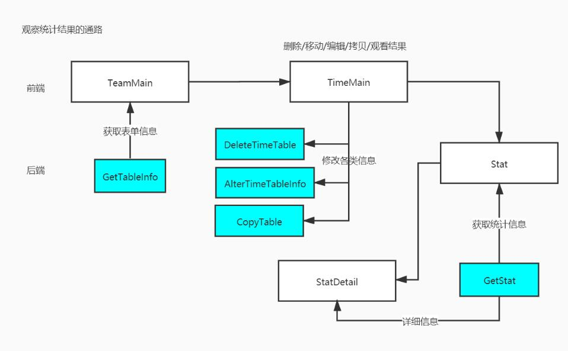

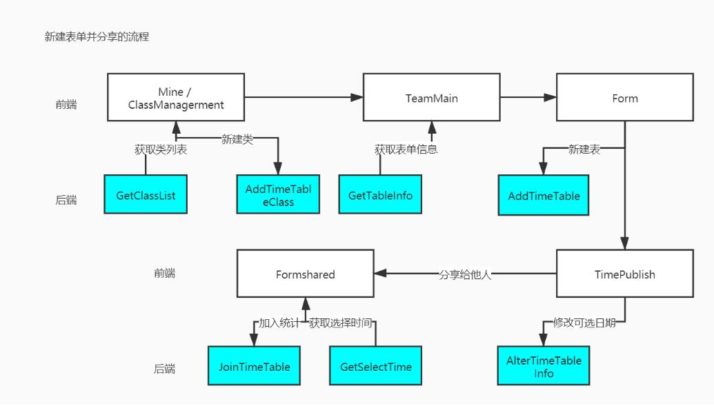

事实上，这部分可以扩展为整个**前端逻辑与后端逻辑**，只不过如果你缺乏代码开发经验，可能并没有办法很清楚的厘清这两个部分，这时你只要辅助工程师去完成这两个部分即可。


**其他你觉得可以辅助表达的部分**

PRD的最终目的是让设计师和工程师明白你的思路，因此任何对理解整个产品有帮助的部分都可以写上，不必拘泥于固有的套路。即使是上面列出的部分，如果你觉得对于这个目标没有必要，也可以不写。这也是需求思想在撰写PRD时一种很好的体现。


#### 原型

当我们通过文档基本了解了我们大概需要做什么之后，这还是不太直观。图片相比于文字总是更清晰的，因此原型制作可以帮助我们更好的传递我们的想法与观念。
原型（prototype）就是关于UI界面的简单绘制，从最简单的手绘，到极度高保真的作品，其实都属于原型的范畴。
常用的原型制作工具及对比如下：

| 工具     | 价格 | 平台                              | 特色       | 备注 |
| -------- | ---- | --------------------------------- | ---------- | ---- |
| Adobe XD | 免费 | Win/Mac客户端                     | 插件       |      |
| 墨刀     | 免费 | 网页端                            | 简单易上手 |      |
| Figma    | 免费 | 网页端/WinMac客户端<br>（全平台） | 协作       |      |
| Sketch   | 付费 | 限Mac客户端                       | 专业       |      |
| ProtoPie | 付费 | 全平台                            | 交互完善   |      |
| Auxre    | 付费 |                                   |            |      |


原型又分为低保真原型与高保真原型，顾名思义，就是原型与真实App最终的接近程度不同。有什么区别呢？事实上，大部分人一开始可能会觉得高保真原型看起来更酷。让我们切换到之前所说的产品思维去想一想这个问题——做原型的目的是什么，即需求是什么？其实只是为了把话说清楚，把观念表达清楚罢了，毕竟原型的设计对最终实现的代码起不到太大帮助。因此，如果通过低保真的简单原型就可以较好地传递我们的想法，也不必要一味的追求高保真原型。此外，高保真原型也对你的设计水平有一定的要求，如果你仅仅是一个产品经理，把这些交给专业的设计师来做或许会事半功倍。

对于加入产品部门的你们来说，使用过墨刀让你们对原型制作没有那么陌生。至于具体的各个原型制作软件有什么优劣区别，随着这些产品的迭代都会有所不同，放在本书里也不太合适。我想直接去搜索相关评测，或试用了解，观看这些文档的手册都会更有帮助。


接下来，设计师会对我们的原型做设计上的调整，统一配色，尺寸，等等，提供设计资源，接下来就到了真正代码落地的阶段了。

#### 研发

研发分为三个部分，数据，前端，后端。这部分你可以在后面技术知识部分的章节略作了解。简单来说，数据是数据如何存储，后端是我们如何操作数据，而前端则是将具体的页面展现给用户，也就是UI部分设计。

我们先前提到的业务逻辑，数据通路，可以帮助工程师设计数据库，开发后端。

而设计师的原型会被前端工程师参考，设计出优美的页面。

因此设计和研发两个部分未必要遵循严格的先后关系，一般来说，设计的同时可以进行数据库和后端的设计，等到原型优化完毕后再进行最后的前端开发。

研发部分内容无须说明太多，我们只需要尽可能满足工程师的需求即可，主要是让他们理解业务逻辑，同时提醒未来迭代可能扩展的部分，让代码设计上具有前瞻性，可扩展性。


#### 测试

当一个产品开发完毕后，测试是必不可少的。

测试不是随便发给几个人瞎点点划划就可以了，虽然大部分情况下我们确实是这么做的。

接下来会介绍一些测试领域的概念，帮助大家理解测试和测试的重要性。

**模块化测试**

相信大家都做过这样的概率论题

> 电路A->B，直接测试A->B整体不如分别测试A模块和B模块的好坏方便

这也就是模块化测试的主要目的——节约成本。一个大的产品往往是有很多小的模块构成的，单独测试这些模块既可以节约人力物力，同时将特定的模块分给特定的人员测试，可以对单一模块进行较为完备的测试。

**边界情况测试**

测试时除了测试正确的逻辑通路，由于用户可能会由于误触等原因进行意料之外的操作，因此各种特殊情况的测试是十分有必要的，这也是我们UX部分容错性思想的体现。具体的意思相信大家看了下面这个段子都能明白

> 一个测试工程师走进一家酒吧，要了一杯啤酒；
>
> 一个测试工程师走进一家酒吧，要了一杯咖啡；
>
> 一个测试工程师走进一家酒吧，要了0.7杯啤酒；
>
> 一个测试工程师走进一家酒吧，要了-1杯啤酒；
>
> 一个测试工程师走进一家酒吧，要了232杯啤酒；
>
> 一个测试工程师走进一家酒吧，要了一杯洗脚水；
>
> 一个测试工程师走进一家酒吧，要了一杯蜥蜴；
>
> 一个测试工程师走进一家酒吧，要了一份asdfQwer@24dg!&*(@；
>
> 一个测试工程师走进一家酒吧，什么也没要；
>
> 一个测试工程师走进一家酒吧，又走出去又从窗户进来又从后门出去从下水道钻进来；
>
> 一个测试工程师走进一家酒吧，又走出去又进来又出去又进来又出去，最后在外面把老板打了一顿；
>
> 一个测试工程师走进一家酒吧，要了一杯烫烫烫的锟斤拷；
>
> 一个测试工程师走进一家酒吧，要了NaN杯Null；
>
> 一个测试工程师冲进一家酒吧，要了500T啤酒咖啡洗脚水野猫狼牙棒奶茶；
>
> 一个测试工程师把酒吧拆了；
>
> 一个测试工程师化装成老板走进一家酒吧，要了500杯啤酒并且不付钱；
>
> 一万个测试工程师在酒吧门外呼啸而过；
>
> 一个测试工程师走进一家酒吧，"< script >alert("要了一杯酒");< /script >"
>
> 一个测试工程师走进一家酒吧，要了一杯啤酒';DROP TABLE 酒吧；
>
> 测试工程师们满意地离开了酒吧。
>
> 然后一名顾客点了一份炒饭，酒吧炸了。


#### 推广

当一个产品被开发完毕后，他就进入了推广与运营的生命周期。

推广，顾名思义，把产品推广给用户。对于求是潮的产品而言，大部分情况下都是依赖其他产品相互引流，发放传单的形式，同时纳新季是我们的主力推广期。由于这里仅是介绍工作流，关于具体的推广细节与方式你可以在《面向管理的产品手册》中查阅。


#### 运营与迭代

当一个产品面世，需要运营来维持其生命活力，当产品有更新的功能时，就迭代发布。运营并没有固定的范式，它依赖产品的定位与形式。如对于淘宝，运营包括解决用户的投诉、问题，但对微信可能就没有这种苦恼。一般来说，以下几个方面需要我们额外注意

##### 用户反馈

产品交由用户使用，而用户可能对产品有一些建议或意见。如果我们无法建立与用户沟通的桥梁，获取这部分反馈并进行迭代，那么用户就会积怨而后流失。因此收集用户的反馈是运营的一个重要方面。

对于较大的产品，一般会安排专门的客服来接收用户反馈。

但对于求是潮产品而言，人力资源有限，目前是通过求是潮产品反馈QQ群来集中接收并答疑。那么这个时候接收用户反馈的要点就变成了让用户知道有这样一个渠道，从而在遇到问题时可以有效地求助于我们。

用户反馈是十分重要的，在2019年刚刚建立求是潮产品用户反馈群时，群人数几乎瞬间破了一千，并且当年选课期，我们的选课助手冲到了360插件榜的榜首（当然360浏览器也没什么人用啦X）。好的反馈接收可以提升产品在用户处的口碑，从而也起到推广的作用。


**Bug修复**

尽管我们可能经过了十分严密的测试，但bug仍然可能出现。及时地发现这些bug并快速地解决也是运营的重要部分。


##### 常规运营

对不同类型的产品可能有需要常规运营的内容。如对Notify，产品人工对信息进行打标签就是日常的运营；哈罗单车对单车的搬运与维护；前面提到的求是潮Share对资料的人工放置……

简单来说，产品设计部分的“非全自动”部分也可以算作日常运营的成本。


至此，我们才完成了对整个产品全生命周期的工作。


## 领导力

产品经理往往是团队中的Leader，需要沟通各部分，协调工期等等。这需要我们有足够的领导力，我想有必要在这里提出，具体的内容可以参考仓库内的《领导力养成心得》


## 技术背景知识

了解一些技术知识，可以帮助我们更好地规划产品，尤其是我们在PRD处提到的业务逻辑，数据通路等部分。也可以让你更好地和工程师沟通。掌握这些知识的最好方法永远是你自己去实践，在B站上搜索相关的课程，只需要前面简单的几课，写一写最简单的代码，你就可以理解工程师的思路了，也可以避免产品经理被程序员拿刀追着砍的情况发生。

这里仅仅是希望让你对这些技术背景知识有一些整体的概念，希望这些叙述能引起你的兴趣。

### 前端与后端 - Overview

如何区分前端与后端？哪些任务是前端的，哪些任务应该后端来负责完成？  

首先需要说明，前后端是“工程中出现”的分工概念，是一种“被大多数工程团队采用的一种分工范式”，并不如定理定义一般能够百分之百明确区分。在工业生产中，一些任务是可以扯皮的，可以由前端完成也可以由后端完成。但，求是潮的技术栈还浅，前后端是区分得比较明确的。

产品人至少应当内对潮内工作的前后端划分有比较清晰的概念。以此为起点，应当了解研发工作的基本过程、应用的基本结构。

---

这里先给出前端和后端的宏观概览：

> 前端的工作核心是做出 **“界面”** 与 **“交互”** 。

网页如何排版？ 产品给出的交互逻辑如何实现？这些呈现给用户的图形化信息，由产品给出方案、由设计提供素材，前端负责整合，在用户的浏览器或者 app 上实现。
以下词语常与前端相联系：“动画渲染” “页面跳转” 等等。

传统的前端三件套是：

+ 布局：html
+ 样式：css
+ 逻辑：javascript

就像我们在UI部分的介绍顺序那样。我们首先要确定页面内的大致框架，比如tabbar， 抽屉， 瀑布流。这些就对应着html。
到了具体组件的设计，如阴影，颜色，圆角，这些就属于具体的样式，属于css的范畴。
完成了这些，我们就需要考虑UI如何与用户交互，响应用户的操作，这就对应着js部分的逻辑。“事件”其实是更为精确的一种描述，交互的过程本身就是给App一系列事件，如点击事件，松开事件，拖拽事件，输入事件。在具体的代码实现上，我们可以为每一个事件安排一个回调函数，一旦触发了某个事件，就会执行对应的**回调函数**。

> 后端则是围绕 **“数据”** 展开工作，存取前端的信息，并为前端处理和提供信息。

后端的工作往往是非技术人员不容易想到的问题，比如说鉴权（用户身份认证），比如说数据管理（例如在 mobile 和 notify 之间同步数据等等）。
以下名词常与后端相联系：“数据库” “数据存取” “身份认证” 等等。

为了保证双方配合得顺畅，前后端应当通过 **“前后端接口文档”** 来进行配合。它包括但不限于以下要素：
  - **交互的信息。** 后端需要提供哪些信息给前端，或是前端需要提供哪些信息给后端。
  - **形式和要求。** 例如，用户名和密码需要经过 base64 编码，用 xxx 秘钥加密后发送，等等。
    它就像一个说明书，告诉一方，另一方的数据、接口应当如何使用。因为前端不可能去读后端的源码，后端也不可能去读前端的源码，因此，前后端接口文档应当将双方需要的信息描述完整、力求清楚。

当然，实际操作的前后端接口文档有固定的范式，而非繁冗的文字表达。除此之外，还有中管负责调度。

前端访问后端的方式可以通过我们前面提到的事件对应的回调函数。回调函数里访问一些后端接口（Api）用来实现对应的功能，比如在数据库中对数据进行增删改查。后端是对行为逻辑的抽象与封装。比如我们在前面产品设计的过程中可以需要从数据库获取数据，可以是点击一个按钮获取，可以是加载时自动获取，可以是下拉刷新获取。但这只是前端上的区别，对后端来说，都是同一个获取数据的Api而已。一些复杂逻辑的计算，比如一些算法，也可以在后端服务器上以更高的效率运行。

####  app 中的前后端交互

对以上三者有了大概印象之后，我们再来看看 app 中具体的前后端交互。就以 rop（求是潮开放纳新平台）为例。设想以下场景：

- 用户在地址栏中输入 rop 的地址，并按下回车，准备打开 rop 网页。此时：

- *浏览器向求是潮服务器发送请求*，希望获得该网站的页面。求是潮服务器会负责 **从某个地方找出存储的页面内容，并发回给浏览器** ，但是是以代码的形式。例如 HTML、js 脚本等等。此时看起来一般长这样：


- 浏览器将这些代码进行解析，渲染出我们看到的图形界面，呈现给用户。

可以是这样的场景：

- 用户点击“使用求是潮 Passport 登录”，准备跳转到另一个登录页面。

- 这个按钮*已经被编好了功能*，它被点击后*触发一段 js 代码*，来*对求是潮服务器发送请求*。

- **服务器与前面一致地发回页面内容**，浏览器解析。

- 之后，用户在页面中输入用户名和密码，点击登录。准备获得登陆成功或失败的结果反馈。

- 此时，这个页面可能会做这些事情：随着用户的输入，将用户输入的用户名*回显在界面上，密码用 * 号回显*，以供用户检查和修改。

- 按下登录按钮后，*一段 js 代码被触发*。浏览器将用户的*输入表单进行编码、加密，发送给服务器*。

- 服务器收到浏览器的请求，**解开加密**，在**数据库中查找用户名和密码是否对应**，将**结果发回浏览器**。

也可能是这样的场景：

- 用户使用机器人对 rop 进行爆破。对方在 1 秒内发出了 1 万个请求，对每一个请求，求是潮服务器都需要发出相应的信息，如此一来，带宽不够用了，正常其他用户的请求便无法被响应。
但这样的事情无法发生。因为：

- 求是潮服务器会**对异常流量进行监控**。例如，它发现同一个地址发出了 1 万个请求，**判定它为恶意用户，选择屏蔽该地址发出的请求**。

此时，你已经了解了大概的网页工作步骤。在这些步骤里，所有前端完成的功能全部用 *斜体* 标注，后端完成的功能都用 **加粗** 标注，剩余没有标注的一般是浏览器自己完成的功能或是情景描述等。
以上涉及到了前端的“渲染”“动画反馈”，后端的“身份认证”“数据库存取”等职能实现，希望能对你建立前后端概念有所帮助。

> 另外，需要说明的是，以上的划分并不完全严谨，部分掺杂了运维等人员的工作。为了易懂起见，这里不做区分。


### 数据库

数据是存储在数据库内的，我们这里仅介绍**关系型数据库**。

关系型数据库是采用关系建模的，存在数据库内的就是一张又一张的表。

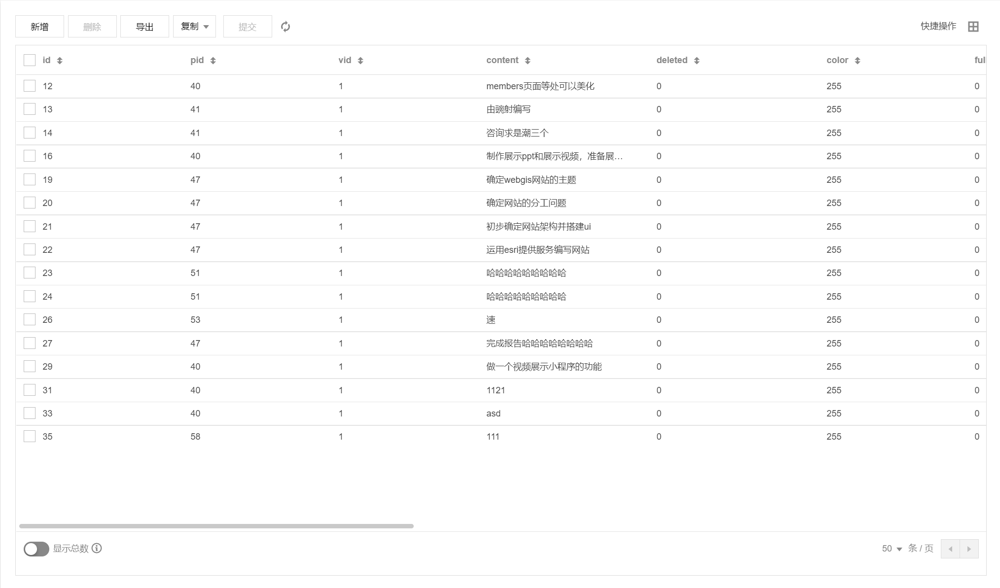

举个例子，我们对学生选课进行建模。

需要记录的数据有哪些呢？

+ 课程和课程的详情
+ 学生和学生的详情
+ 学生选课的关系

第三点就是**关系**的体现，用于描述学生和课程之间**选课**这样的关系，并且这个关系是多对多的，一个课程可以对应多个学生，一个学生也可以对应多个课程。类似的我们也有“一对多”，“一对一”的建模方式。

那么这样的关系转换为表，就变成了三张表

+ 学生（学号，学院，年级，手机号，姓名，……）

+ 课程（课号，课名，开课学院，……）
+ 选课（学号，课号，选课学期，……）

数据库具有以下特点

+ 结构化数据，即我们使用的“表”

+ 共享性高，冗余度低

  设想我们建模为这样的一张表

  + 选课（学号，课号，学生姓名，课名……）

  这时一个学生的信息可能就会被存储很多次，当一个学生选了多门课时。同理，课程的信息也会冗余存储多次

+ 数据独立性高

  当我们想修改学生的信息时，修改学生表单内的信息，选课的信息自然也会更新，因为选课表中我们只记录了学号的信息，再去通过学号查询具体的学生信息。

那么我们是如何得到这三张表的呢，这涉及到ER图建模，在这里不做展开。作为产品经理，你只需要大概了解数据是用这样“表”的形式存储，同时操作数据的过程无非就是**增删改查**就可以了。

当你设计一套业务逻辑，数据通路的时候。可以自己脑补一下这些表单是如何变化的，是否能满足你的需求。

最后，我们用一个具体的例子去讲解，什么是数据建模的前瞻性和可扩展性。

仍然是学生，课程，选课这三张表。假如我们希望别的学校的同学也可以选我们学校的课。这时就会出问题，因为两个学校的学号可能是一样的，这时选课表中就需要额外记录学生的学校。但在表中新增字段是十分麻烦的，涉及到访问这张表的后端接口都需要修改。如果是更复杂一些的功能，可能实现起来就有些力不从心。但如果我们提前知道这种可能，哪怕先不去实现，只是预留了学校这个字段，在未来功能扩展起来就会变得十分容易。

这也是为什么在前面PRD的部分我们提到，哪怕不是目前开发周期的功能，也应该先告知工程师，让其设计合理的表单为未来的功能提供可扩展性。


## 扩展

在这一章节，我们会介绍一些对于产品经理工作十分有帮助的其它内容。

### 文本编辑

提到文本编辑器，你的第一印象可能是word。但你是否因为word加载速度太慢，word动不动崩溃等问题烦恼过？

事实上，我们有更多的排版文字的方式，如这里使用的markdown，还有对数学公式排版较为美观的$\LaTeX$​​​（例图如下）。

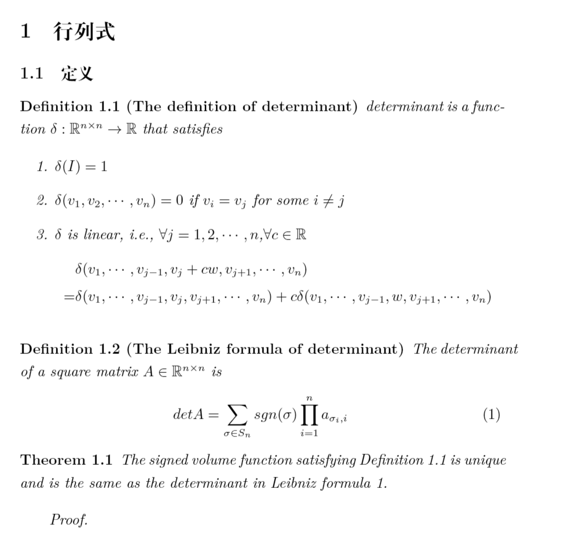

markdown和$\LaTeX$都是一种语法，markdown较为轻量，适合我们大部分场景下不需要复杂排版的需求。

下面简单展示一些markdown的简单排版

+ 输入 '+ ' 在行首为无序列表

1. 直接输入'1 '为有序列表

> ’>' 为引用文本

```python
```python 三个反引号为代码文本
# python codes
```

至于markdown的编辑器，你可以下载Typora而后开始你的markdown之旅。


$\LaTeX$一般需要较为复杂地配置本地环境，或使用overleaf在线编辑。如果你想先尝试一下，可以在[overleaf](https://overleaf.com/)上尝试。

