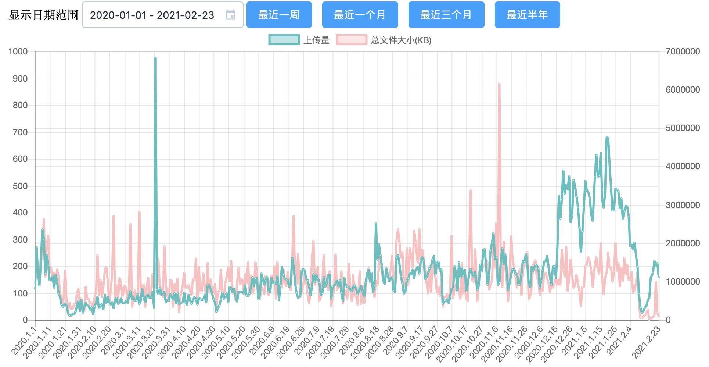

# 产品产出统计

## 选课助手插件

总用户量：20742

日激活数峰值：72027次（2020-12-25）

DAU(日活跃用户数）峰值：10239（2020-12-25）

## Mobile系列

自首版Mobile上线至今，累计用户：250697

### Mobile iOS Version 3

累计用户数：59234

2020年度DAU均值：3581

2020年度DAU峰值：8682

2020年度启动次数累计：6257308

2020年度日启动次数均值：17096

2020年度日启动次数峰值：141230

### Mobile Android Version 3

累计用户数：110109

2020年度DAU均值：7191

2020年度DAU峰值：14755

2020年度启动次数累计：11037625

2020年度日启动次数均值：26820

2020年度日启动次数峰值：142854

## 求是潮纳新开放平台ROP

2020年度报名人次：1067人

### 求是潮

2020春季纳新：57人

2020秋季纳新：419人

### 浙江大学管理学院学生会

2019秋季纳新：67人

### 浙江大学医学院学生会

2019秋季纳新：57人

### 浙江大学学生Fantasy动漫社

2020秋季纳新：353人

### 浙江大学学生机器人协会

2020秋季纳新：98人

### 浙江大学求是学院丹阳青溪学园学生会

2020秋季纳新：140人

## BOX

2020年上传文件统计

上半年居家期间用户较少，平均每日上传文件数量约为100左右，总文件大小平均约为1400MB左右，下半年显著提升，平均每日上传文件数量达到200左右，总文件大小平均可达1600MB左右。

上传量峰值出现在3月22日为974。

目前box内存储有82.609GB的文件

## 其他项目

### 浙江大学2020新生手册

26891字

### app4u系列推文

#### 《有限屏幕 无限效率》

阅读 3835

在看 85

### 《如何优雅地交作业》

阅读 3156

在看 57

### 十七届网络文化节

由于疫情原因，2020年的网络文化节仅仅举办三次线上讲座分别为

+ 《微软小冰：人工智能的第三种选择》 时长：1小时47分22秒 观看人数：125
+ 《浙大钉专题讲座》  时长：1小时3分钟39秒 观看人数：132
+ 《韦路老师：X媒体时代的危机传播》  时长：2小时25分13秒 观看人数：372

