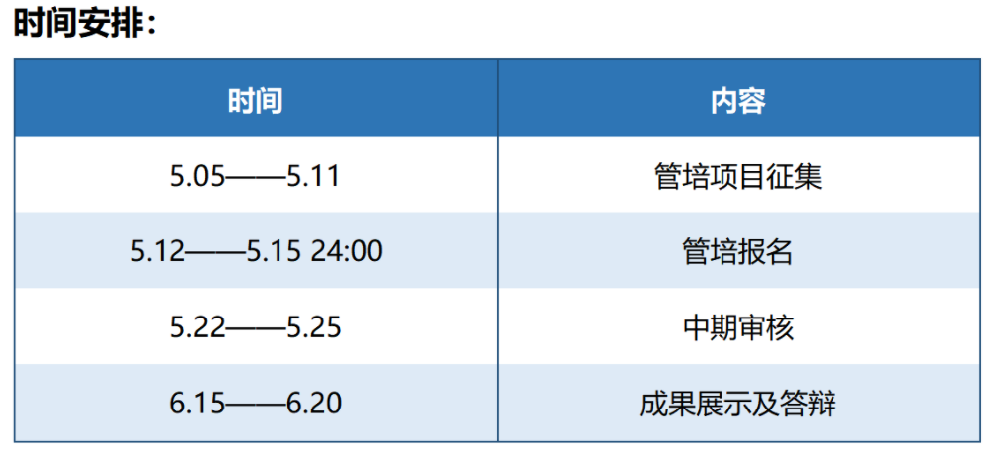

# 新生手册&暑假特辑

## B组管培项目简介

新生手册&暑假特辑 是一项传统管培项目，意味着有一定的资料和经验可以参考。

## 资源介绍

主要参考资料来源：

1. 培训地带往年管培帖
   * 【20管培B组】新生手册2020和暑假特辑
     https://bbs.zjuqsc.com/forum.php?mod=viewthread&tid=65057
     (出处: 求是潮工作论坛)
   * ……省略
2. 往年新生手册
   * 2020年https://newbie2020.zjuqsc.com/
   * 2019年https://newbie2019.zjuqsc.com/
   * 中间2年没找到网页，参考管培帖
   * 2016年https://new.zjuqsc.com/
   * 2015年https://f.zjuqsc.com/
3. 求是潮微信公众号
4. 向老人询问获取资料
   * **部分资料我已放到src文件夹中**

## 现有情报

1. 期末考试周6.30-7.8
2. 今年7.9-7.23左右第一批军训（大一升大二）
3. 7.9-7.23期间其他年级安排暑期小学期
4. 大一升大二的同学军训后安排暑期小学期
5. 新生报到时间9.10？

## 开展思路

1. 注意时间安排

* 尽快组织第一次组内会议
  * 确定总负责人
  * 确定分工
  * 确定时间线
    * 确定中期审核大致进度
    * ……
  * 从第一次组内会议开始后在bbs后台论坛「管培地带」开帖
    * 记录组内人员
    * 记录工作进度
      * 会议记录
      * ……
    * 汇总工作成果
    * ……

2. 管理培训计划：注重大家管理能力的培养，举例说明，希望大家从以下角度出发考虑问题：
   * 我做的内容面向对象是什么：
     * 新生手册面向对象是什么？
       * 受众会读完整本新生手册吗？
       * 受众希望新生手册有什么内容？
       * ……
     * 暑假特辑特辑面向对象是什么
       * 有已关注求是潮的受众吗？
       * 有未关注求是潮的受众吗？
       * 受众希望从暑假特辑里看到什么？
       * 有哪些内容是受众感兴趣的？
       * 有哪些内容是对受众有用的？
       * ……
   * 从求是潮管理者角度出发，我希望输出什么？
     * 新生手册中，求是潮要展示怎样的形象和内容？
       * 新生手册可以展示哪些求是潮产品？
       * 新生手册可以展示求是潮的哪些文化？
       * 新生手册可以展示求是潮的创造力吗？
       * ……
     * 暑假特辑中，求是潮要展示怎样的形象和内容？
       * 可以展示哪些求是潮专业性的内容？
       * 可以展示哪些求是潮文化的内容？
       * ……

## 去年经验

### 新生手册

1. 2019年新生手册文字介绍过于简洁，为此，2020年工作重心放在了完善文案上，20年最终在2015（16）的版本上完成了文案，着重对其中过时/有变动的内容有更新。20年并无太多新增内容，有待补全，同时要注意**20年新生手册没有军训部分**，需要补全。

   具体的内容和形式上的更新取决于实际的管培参与人员，无论是锦上添花还是推到重来都没有关系，最重要的是要组内达成一致，在这个基础上才能说服别人。
   
2. 新生手册要注意提高覆盖率，最佳选择当然是纸质版放到录取通知书里，其次是放到新生报到大礼包里，这部分工作首先需要纸质版的尽快成型和通过学工部的审核，然后联系到具体的本科生院招生办（学工部效率不高，需要多催促，同时也要预见这部分工作有充分的难度）

   除此以外还有很多宣传形式可以附加，包括但不限于：

   * 「求是潮」微信公众号推文

   * 新生群（如果有）

   * 求是潮纳新

     * 求是潮纳新传单

     * 求是潮产推传单

     * 其他和纳新结合的宣传形式

       和有关纳新的问题可以询问组里的人资同学

   * ……

3. 注意协作和排版问题，去年前期分工没有考虑排版，后期整合排版工作很痛苦。建议今年提前考虑排版问题，推荐使用MarkDown格式进行图文排版，甚至可以考虑使用Giithub进行协作。（本文档就是使用markdown规范，typora软件写作，导出为pdf格式）

   

### 暑假特辑

1. 20年暑假特辑策划，受疫情等因素影响，基本没有落地实现，应当着重注意和组内推广的同学沟通和实现。
2. 具体的推文形式可以多咨询组内推广同学，在条件允许的情况下，可以考虑在idea基础上进一步给出更多信息（时间线安排、素材准备等），同样是遵循提高落地实现可能性的原则。
3. ……

## Q&A

待更新