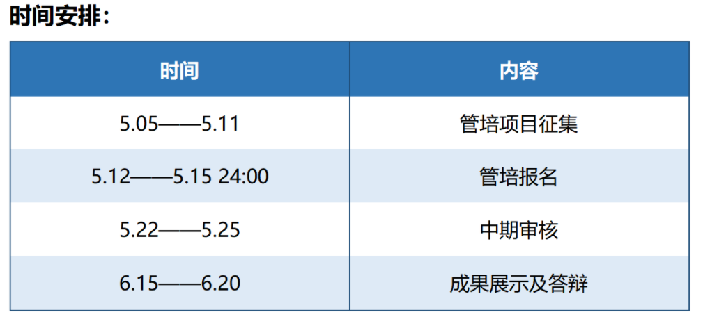

# F 小程序管培组 QSCamera线

## 更新日志

| 版本   | 时间      | 更新人 | 备注                                                         |
| ------ | --------- | ------ | ------------------------------------------------------------ |
| v1.0.0 | 2021.5.19 | 豌射   | 新建文档，完成文档框架                                       |
| v1.0.1 | 2021.5.22 | 豌射   | 新增更新日志； 新增‘其他经验-B端产品-2-可能存在**查询（权限）问题**’ 新增‘其他经验-工作流-3关于协作’ |

## F组管培项目简介

F组求是潮小程序项目管培组，顾名思义，就是求是潮的2个小程序项目，只是管培项目名额有限，于是“合成大西瓜”。

先说为什么要做微信小程序，有以下几点原因：

1. App审查收紧，以去年Mobile Android下线为例，审查周期查，上线难度大。
2. 微信生态逐渐完善，微信小程序开发难度低，用户接触面广。

## QSCamera简介

复读管培计划

> QSCamera 是由视频团队沈吕可晟学长开发的一款运营中的器材借还微信 小程序。旨在简化借还流程，加强部门沟通，同时便于器材损害追责。自 20-21 学年起，求是潮视频团队和摄影部采用 QSCamera 进行器材借还管理。 
>
> QSCamera 具有器材借用与归还，器材记录订阅，器材当前状态查询功能。 同时对于拥有后台管理权限的部门中管可以管理后台信息与设备管理（新增或删 除），还可以查询借用记录并依次进行损坏/丢失追责。
>
>  QSCamera 下一步计划由网络工作室继续开发，完善当前版本，探索其他面向 B 端的借还产品使用场景，首要任务是梳理现有产品逻辑，挖掘需求，明确开发方向，同时继续沿用小程序的平台，以期为今后求是潮微信小程序开发提供经 验。

QSCamera作为沈吕可晟学长开发的第3个小程序，相对成熟。

> 前端由原生小程序 html\css\javascript 开发，采用 colorui 库进行 UI 设计，后端采用微信云开发数据库，80%页面采用组件化开发手段，可扩展性与可维护性强。

曾获2020小程序云开发挑战赛校园赛道一等奖。

[#小程序云开发挑战赛#-QSCamera-Incas](https://developers.weixin.qq.com/community/develop/article/doc/0006a8dd4f89684f45fad49fc56c13)

## 资源介绍

1. bbs视频团队相关资料文档

   * ※视频团队工作规范※
     https://bbs.zjuqsc.com/forum.php?mod=viewthread&tid=65192
     (出处: 求是潮工作论坛)
     * [【附件一】摄影部与视频团队互借器材协议.pdf](https://bbs.zjuqsc.com/forum.php?mod=attachment&aid=MzkxMjIxfDc4YmQ5NWJhfDE2MjEzOTQ3NTl8MTU3NjN8NjUxOTI%3D) 
     * [【附件二】QSCamera使用文档.pdf](https://bbs.zjuqsc.com/forum.php?mod=attachment&aid=MzkxMjIyfGRjZjM2MGNifDE2MjEzOTQ3NTl8MTU3NjN8NjUxOTI%3D) 
     * [2020视频团队工作手册.pdf](https://bbs.zjuqsc.com/forum.php?mod=attachment&aid=MzkxMjMzfDJmY2FhZGZjfDE2MjEzOTQ3NTl8MTU3NjN8NjUxOTI%3D) 

2. Github相关资料

   https://github.com/Fantast416/WxApp_QsCamera

   * 使用文档

   * 开发文档
   * 源代码

3. **QSCamera小程序**本身

   * 功能流程

     * 首次进入：注册
     * 后续进入：登录
     * 首页：信息修改
     * 器材查询
     * 器材借用
     * 器材归还
     * 出借记录
     * 我的记录
     * 后台管理
       * 管理员（中管）认证
       * 信息查询
       * 信息修改
         * 用户信息
         * 器材信息
     * ……
   * 界面交互
   * ……
   
4. OpenProject https://project.zjuqsc.com/

   * 前期工作成果
     * QSCamera基本信息-志翔.md
     * QSCameraV1.5.1可能存在问题及改进建议-志翔.md

## 现有情报

1. 微信公众平台账号
   * 参见src\SCamera开发者账号信息收集.xlsx
   * 参考列
     * 运营者权限
     * 开发者权限
     * 数据分析者（基础分析）
   * 通过微信公众平台https://mp.weixin.qq.com/登录
   * 私戳豌射联系沈吕可晟学长添加

2. Github账号
   * 参见src\SCamera开发者账号信息收集.xlsx
   * 参考列
     * 邮箱（Github邮箱）
   * 私戳豌射联系沈吕可晟学长添加

3. Openproject
   * QSCamera项目组前期成员均在组内
   * 登录https://project.zjuqsc.com/注册账号
   * 私戳豌射拉入项目组

## 开展思路

1. 注意时间安排

* 尽快组织第一次组内会议
  * 确定总负责人
  * 确定分工
  * 确定时间线
    * 确定中期审核大致进度
    * ……
  * 从第一次组内会议开始后在bbs后台论坛「管培地带」开帖
    * 记录组内人员
    * 记录工作进度
      * 会议记录
      * ……
    * 汇总工作成果
    * ……

2. 需要完成的任务：基于QSCamera的物资借用小程序改进（产品工作部分）

   * 完成QSCameraV1.5.1业务、功能、页面流程图
   * 标注QSCameraV1.5.1的BUG列表，给出改进方案
   * 开展调研工作

     * 面向对象：
       * 针对现在使用QSCamera的视频团队和摄影部
       * 针对其他有潜在物资借用需求的潮内部门
       * 针对其他有潜在借用需求的校内组织社团
         * 融媒体
         * ……
   
     * 调研目标：
       * 完善改进后的小程序业务、功能、页面流程图
       * 标注重难点
       * ……
     * 调研方式
       * 访谈
       * 焦点小组
       * ……
   * 结合调研与测试，汇总整理QSCamera迭代的工作包
     * 哪些是可以直接做在QSCamera后续版本中的
       * 规划QSCamera V1.5.2
       * 规划QSCamera V1.6.0
       * ……
     * 哪些是要做在基于QSCamera的物资借用小程序改进中的
       * 这个改进与现有QSCamera有何不同，为什么要新做一个？
       * ……
   * 完成基于QSCamera的物资借用小程序产品需求文档架构
   
     * 产品定位
     * 需求（业务）分析
     * 功能分析
     * 业务、功能、页面流程图
     * 低保真产品原型（类似页面流程图）
     * ……

## 其他经验

### 工作流

1. 关于鸽子：

   * 最近一直很忙，想到的东西没怎么做，也没怎么push
   * 一直没停下思考，这个文档基本就是思考成果汇总
   * 因为Push不足的关系，之前QSCamera组内进度不大一致
   * 之后也未必有时间做，主要还是靠大家管培自己努力，我的思考基本都在这了，有什么问题群里随时问我
   * 暂时可以把豌射当成QSCamera线的技术
   * 提交BUG的工作流可以相对独立，每个人可以分别报，可以借助Gitlab，OpenProject等平台
     * 但注意不要重复
     * 或者有人负责合并重复的BUG
   * 报BUG
     * 应当能够稳定复现BUG，给出指引
     * 应当给出优先级
     * 应当给出解决方案参考

3. 关于新产品筹备

   * 一个合理的产品筹备应当有的内容：

     * 给出基于产品需求文档的大致产品框架
     * 给出最小可用版本
     * 给出大致迭代思路
   * 前期分工的建议：
     * 把握轻重缓急和前置顺序
     * 部分内容可以先分工，再一起讨论
     * 确保每个人对产品都有完整的了解
     * 确保各部分的联系是对应的、一体的
     * 最重要的组内要达成一致
   
3. 关于协作

   虽然目前QSCamera线只有产品的同学，但是一个良好的协作体系还是能提高工作效率的。

   * 文档协作
     * 建议使用md和pdf搭配
     * 需要同时编辑的文档可以考虑一些在线编辑的平台
       * 石墨（石墨的md格式有点问题，直接拷贝无法还原正确的格式，需要使用导出）
       * Notion
       * 语雀
       * ……
   * 原型
     * 协作可以尝试Figma（可以在线编辑并协作）
   * 报BUG（提issue）
     * Openproject（但是现在坏了）
     * Github
       * Github也能存储其他文件，只是同时编辑可能会有问题
     * Gitlab（目前没有技术，可以视为暂时无法使用）

### B端产品

1. 相比于需求是C端产品的核心，追求极致的用户体验，B端产品的核心核心是流程，追求提速增效。

2. 但问题是，我们现在不知道QSCamera存在什么流程问题，但可以预见一些：

   * 以ROP求是潮纳新开放平台为例，存在很多流程问题

     * 面试轮次不同
     * 面试参与部门数目不同
     * 面试确认\通过等
     * 面试管理误操作等
     * ……

   * 类似的我们可以试想一下QSCamera可能存在什么流程问题：

     * **查询（权限）问题**
       * 显然现有的QSCamera只有求是潮视频团队和摄影部两个Unit在使用，他们有以下特征：
         * 人员不重复
         * 所有设备均互相可见
         * 部分设备不外借
         * 没有外部人员借用器材
         * ……
       * 但如果新增其他Unit，在查询（权限）上很容易想到一些问题
         * 理论上，新增某潮外组织 A，A的人员应当不能查看求是潮的设备
         * 但如果 有一位同学 既是潮人又是A人
           * 应当注意到，QSCamera目前是以手机号作为用户唯一标识的
           * 在这种情况下，他应当能够通过某种形式查询到求是潮和A的器材并借用
       * 另一个问题是，如果有些设备是开放外借的
         * 外借者可能需要新建账号，但并不归属组织
         * 外借者应该只能看到一部分器材
         * 外借者应当只能借用一部分器材
         * 外借者也可能是其他在使用QSCamera的组织的成员
         * ……
     * 借用时长有无限制
       * 是否可以续借？可以续借几次？
       * ……
     * 借出申请和审核模式不同
     
       * 是否需要提前申请
     
       * 如何审核
     
       * 谁来审核
     
       * ……
     
     
     * 借出填报确认内容不同
     * 归还确认不同
     * 器材管理模式不同
     * ……
   
3. 为了解决这个核心问题，我的建议是：画流程图（业务、功能、页面流程图）

   [B端产品设计3大流程图：业务流程图、功能流程图、页面流程图](http://www.woshipm.com/pd/3873765.html)

   其中，业务流程图为实际完成的任务，不与产品相直接联系（没有QSCamera视频摄影以前也借器材）；功能流程图与业务流程图相对应，为产品哪些功能具体对应实现哪些业务逻辑；页面流程图则是将功能具体映射到页面，更接近产品实体。

4. 有了QSCamera流程图之后，再以此为基础进行调研，再根据调研成果做基于QSCamera的物资借用小程序流程图。

5. B端产品注定要向B端推广，建议从调研开始就进行B端资源的积累，前期可以不要贪多，一家一家的纳入用户群体。

### 小程序开发

1. 对于小程序的实现能力：可以直接先咨询F组里的技术同学
2. 小程序有个概念：“组件”，可以考虑学习一下
3. ……

## Q&A

待更新
