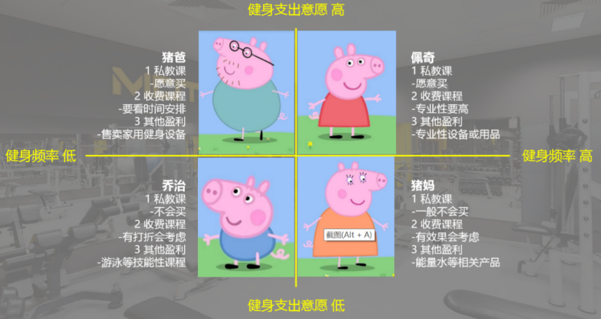
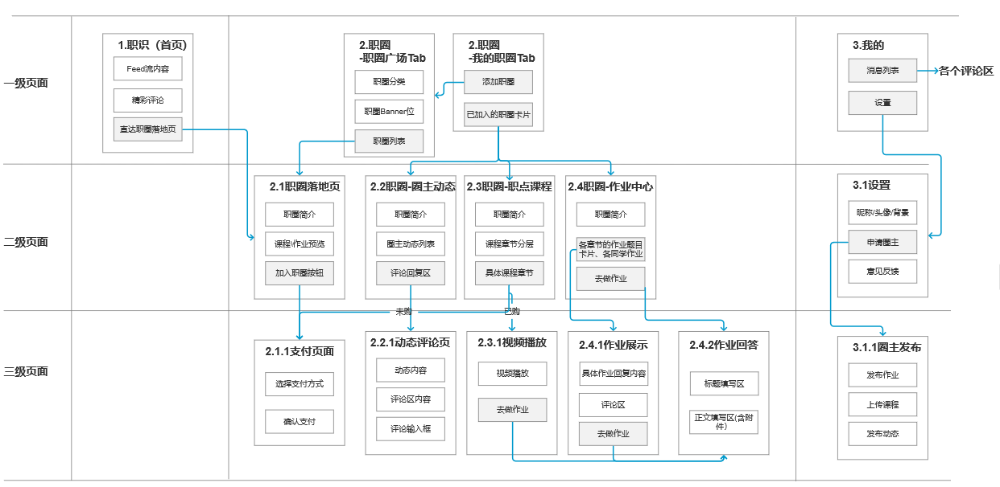

# Readme: 

本方案中会有大量“分数”出现，然而对于面试而言，分数绝不是主要参考依据，而是作为引导面试者的工具。

二面在进一步观察面试者是否具有**产品思维**的同时，关注面试者的合作能力、表达能力等。

产品思维可以由**从需求出发**体现，**用户画像**是需求的整理、归纳与概括；在需求的基础上，可以确定产品的功能，但功能是一个个零散的，因此**页面流程图**可以考察面试者对产品的整体思维。

为了避免面试者将及其有限的现场二面时间浪费在无意义的细节中，**手绘原型**仍然过于复杂，我们通过B类细节的加分鼓励面试者更多地做出产品方向的思考，同时对于有价值但和**产品思维**联系不大的A类细节、C类细节，我们仍然会给到一些加分，但有上限限制。

另外，这套评分体系或许之后可以做成比赛。

## 规则

### 不对面试者开放的部分：

1. 面试者的分组应当在现场二面开始前有所准备，视面试者情况稍作调整。大体按一面分组、性格、能力、性别等特性不同尽量平均分配。
2. 面试题应当以C端产品为样本。
3. 面试题应当避免不同组面试题目雷同的情况，这会造成面试者恶性竞争，实际上面试题目表现与后期工作表现并无直接联系。
4. 提前确定面试可以使用的工具等。
5. 合作探索环节中，每组会派驻一位固定观察员，观察员的首要任务是记录面试者的合作情况（包括分工、引导、冲突、协调等），其次是记录进度。观察员可以视情况回答所负责小组的问题（能让面试者自行合理假设的就让其自行假设），如有必要，可以向面试官咨询问题由面试官统一解答。

### 对面试者开放的部分：

1. 在现场二面之前，应当确保面试者有充分参与面试的时间，同时可以（不可以）携带笔记本电脑等工具辅助。
2. 现场二面共分三个环节：规则讲解环节、合作探索环节、展示提问环节。
3. 规则讲解环节：由面试官讲解本场二面规则，讲解完毕后，面试者可就不明白之处提问，由面试官统一解答。
4. 合作探索环节（1h?）：向面试者发放合作探索材料（纸笔等），面试者根据分组，合作讨论题目所涉及产品的**用户画像**和**页面流程图**，以及其他面试者觉得有必要展示的内容。
   * 面试者应当注意控制**页面流程图**的个数与精美程度，在意思表达到位的基础上尽可能追求有用的（得分的）细节。
5. 展示提问环节：在合作探索环节结束后，每组抽签决定展示顺序，每组进行10-15分钟的内容展示。
   * 展示要求该组每位面试者都参与。
   * 在展示过程中，面试者可以主动提及细节的分类，最终裁定权归面试官所有。
   * 在展示的最后，需要面试者介绍自己在分工中所承担的部分。
   * 展示结束后，其余各组每组最多可对该组展示提3个问题，面试官也会进行提问。
6. 关于合作的说明：希望面试者在合作过程中尽可能地整体协作，确保每位面试者都对自己小组的产品有整体的了解，尽量避免按页面类型等粗暴的分工。
7. 评分机制：

* 用户画像（20分）
* 页面流程图（30分）
* 提问环节
  * 提问（-5~5分/个）
  * 回答（-3~3分/个）
* 其他
  * 细节加分
    * A类细节（技术性细节）：对于产品后期的代码开发工作有帮助的细节（2~4分/个）（上限20分）
    * B类细节（产品性细节）：对于产品本身的业务逻辑和用户体验有帮助的细节（3~6分/个）（不设上限）
    * C类细节（运营性细节）：对于产品的运营、推广、迭代等有帮助的策略和细节（1~2分/个）（上限10分）
  * 团队合作（15分）

# 示例（是否向面试者开放有待商榷）

## 用户画像

示例1：

示例2：

示例3：

## 页面流程图

示例1：

示例2：

## 细节加分

以Notify为例：

### A类细节（技术性细节）

"Notify需要将收集到信息分类，分成评奖评优、对外交流等，可以通过关键词对信息进行分类"。

面试官裁定：“关键词作为分类依据，是技术性细节，2分。”

### B类细节（产品性细节）

“Notify的信息详情页，左上角设置了返回按钮，方便用户返回上一级菜单。”

面试官裁定：“是个人都能想到，不计分。”

“Notify允许用户收藏信息，之后在收藏夹中查看，我们觉得这是一个B类细节。”

面试官裁定：“非常普通的B类细节，3分。”

“考虑到信息的分类可能有误，Notify在信息详情页右上角设置了反馈，让用户能够反馈分类错误的信息。”

面试官裁定：“有用的B类细节，可能对Notify产品的核心功能用户体验影响很大，5分。”

### C类细节（运营性细节）

”用户还可以使用Notify将信息分享出去。“

面试官裁定：“运营性细节，1分。”

“我们将会在新生入学时大力推广Notify，通过……”

面试官裁定：“运营性细节，1分。”

“我们将不断收集用户的反馈意见，帮助Notify更精准的分类。”

面试官裁定：“涉及迭代，运营性细节，1分。”